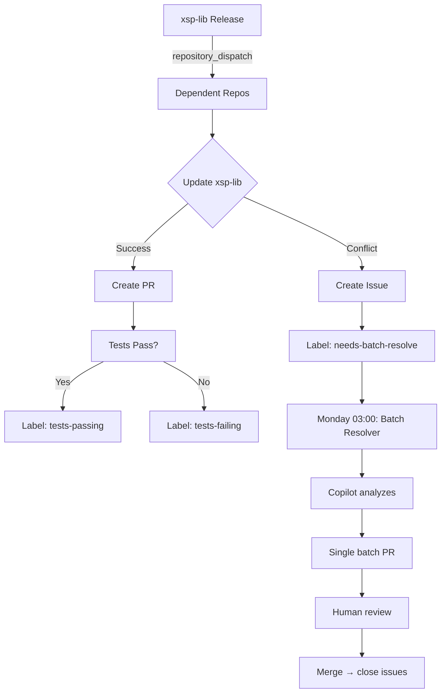

# Cascade Update Setup for Dependent Repositories

Этот файл содержит готовые конфигурации для автоматического обновления зависимостей в репозиториях, использующих `xsp-lib`.

## 📋 Quick Start

Когда создаёшь новый зависимый репозиторий (например, `xsp-app`, `xsp-api`, `xsp-worker`):

### 1. Скопировать workflow

Создай `.github/workflows/auto-update-deps.yml` в зависимом репо:

```yaml
name: Auto Update Dependencies

# Triggered by xsp-lib releases OR weekly schedule
on:
  repository_dispatch:
    types: [dependency-update]
  schedule:
    # Понедельник 03:00 UTC (06:00 MSK) - sync with batch conflict resolver
    - cron: '0 3 * * 1'
  workflow_dispatch:

permissions:
  contents: write
  pull-requests: write
  issues: write

jobs:
  update-dependency:
    runs-on: ubuntu-latest
    
    steps:
      - name: Checkout
        uses: actions/checkout@v4
        with:
          fetch-depth: 0

      - name: Install uv
        uses: astral-sh/setup-uv@v5
        with:
          enable-cache: true

      - name: Set up Python
        uses: actions/setup-python@v5
        with:
          python-version: '3.12'

      - name: Determine update strategy
        id: strategy
        run: |
          if [ "${{ github.event_name }}" == "repository_dispatch" ]; then
            # Triggered by xsp-lib release
            VERSION="${{ github.event.client_payload.version }}"
            TRIGGER="upstream release"
            echo "version=$VERSION" >> $GITHUB_OUTPUT
            echo "trigger=release" >> $GITHUB_OUTPUT
          else
            # Scheduled or manual - update to latest
            echo "trigger=scheduled" >> $GITHUB_OUTPUT
          fi

      - name: Update xsp-lib dependency
        id: update
        run: |
          echo "🔄 Updating xsp-lib..."
          
          # Backup current version
          CURRENT_VERSION=$(uv pip list --system | grep xsp-lib | awk '{print $2}' || echo "not installed")
          echo "current_version=$CURRENT_VERSION" >> $GITHUB_OUTPUT
          
          if [ -n "${{ steps.strategy.outputs.version }}" ]; then
            # Update to specific version
            TARGET="${{ steps.strategy.outputs.version }}"
            uv pip install --system "xsp-lib==$TARGET"
          else
            # Update to latest
            uv pip install --system --upgrade xsp-lib
            TARGET=$(uv pip list --system | grep xsp-lib | awk '{print $2}')
          fi
          
          echo "new_version=$TARGET" >> $GITHUB_OUTPUT
          
          # Update lock files
          if [ -f "requirements.txt" ]; then
            uv pip compile pyproject.toml -o requirements.txt
          fi
          
          # Check if anything changed
          if git diff --quiet; then
            echo "has_changes=false" >> $GITHUB_OUTPUT
            echo "ℹ️  No changes detected"
          else
            echo "has_changes=true" >> $GITHUB_OUTPUT
            echo "✅ Updated: $CURRENT_VERSION → $TARGET"
          fi

      - name: Run tests
        if: steps.update.outputs.has_changes == 'true'
        run: |
          uv pip install --system -e .[dev]
          pytest --maxfail=1 --tb=short || echo "test_failed=true" >> $GITHUB_ENV

      - name: Create Pull Request
        if: steps.update.outputs.has_changes == 'true'
        uses: peter-evans/create-pull-request@v6
        with:
          token: ${{ secrets.GITHUB_TOKEN }}
          commit-message: "chore(deps): update xsp-lib ${{ steps.update.outputs.current_version }} → ${{ steps.update.outputs.new_version }}"
          branch: auto/update-xsp-lib-${{ steps.update.outputs.new_version }}
          delete-branch: true
          title: "⬆️ Update xsp-lib to ${{ steps.update.outputs.new_version }}"
          body: |
            ## 📦 Dependency Update
            
            **Package:** `xsp-lib`  
            **Version:** `${{ steps.update.outputs.current_version }}` → `${{ steps.update.outputs.new_version }}`  
            **Trigger:** ${{ steps.strategy.outputs.trigger }}
            
            ${{ github.event.client_payload.changelog && format('### 📝 Changelog\n\n{0}', github.event.client_payload.changelog) || '' }}
            
            ### 🔗 Links
            
            ${{ github.event.client_payload.releaseUrl && format('- [Release Notes]({0})', github.event.client_payload.releaseUrl) || '' }}
            ${{ github.event.client_payload.workflowUrl && format('- [Triggered by]({0})', github.event.client_payload.workflowUrl) || '' }}
            - [xsp-lib repository](https://github.com/pv-udpv/xsp-lib)
            
            ### ✅ Checklist
            
            - [ ] Review dependency changes
            - [ ] Verify tests pass
            - [ ] Check for breaking changes
            - [ ] Update code if API changed
            
            ---
            
            <sub>🤖 Auto-generated by cascade update workflow</sub>
          labels: |
            dependencies
            auto-update
            xsp-lib
            ${{ env.test_failed && 'tests-failing' || 'tests-passing' }}
          assignees: ${{ github.repository_owner }}

      - name: Handle merge conflicts
        if: failure() && steps.update.outputs.has_changes == 'true'
        uses: actions/github-script@v7
        with:
          script: |
            // Create issue for batch resolution
            const issue = await github.rest.issues.create({
              owner: context.repo.owner,
              repo: context.repo.repo,
              title: `🔀 Merge conflict: xsp-lib update to ${{ steps.update.outputs.new_version }}`,
              body: `## 🔀 Auto-update Merge Conflict\n\n` +
                `**Dependency:** xsp-lib\n` +
                `**Version:** ${{ steps.update.outputs.new_version }}\n` +
                `**Workflow:** [Failed run](${context.payload.repository.html_url}/actions/runs/${context.runId})\n\n` +
                `This update has merge conflicts and will be resolved in batch.\n\n` +
                `### Manual Resolution\n\n` +
                `\`\`\`bash\n` +
                `git checkout -b auto/update-xsp-lib-${{ steps.update.outputs.new_version }}\n` +
                `uv pip install --system xsp-lib==${{ steps.update.outputs.new_version }}\n` +
                `# Resolve conflicts\n` +
                `git commit\n` +
                `git push\n` +
                `\`\`\``,
              labels: ['dependencies', 'merge-conflict', 'needs-batch-resolve']
            });
            console.log(`Created issue: ${issue.data.html_url}`);

      - name: Summary
        if: always()
        run: |
          echo "### 📦 Dependency Update Summary" >> $GITHUB_STEP_SUMMARY
          echo "" >> $GITHUB_STEP_SUMMARY
          echo "**Package:** xsp-lib" >> $GITHUB_STEP_SUMMARY
          echo "**Current:** \`${{ steps.update.outputs.current_version }}\`" >> $GITHUB_STEP_SUMMARY
          echo "**New:** \`${{ steps.update.outputs.new_version }}\`" >> $GITHUB_STEP_SUMMARY
          echo "**Changes:** ${{ steps.update.outputs.has_changes }}" >> $GITHUB_STEP_SUMMARY
```

### 2. Добавить Renovate (опционально)

Создай `.github/renovate.json` для еженедельных routine updates:

```json
{
  "$schema": "https://docs.renovatebot.com/renovate-schema.json",
  "extends": ["config:recommended"],
  "packageRules": [
    {
      "matchPackagePatterns": ["^xsp-"],
      "groupName": "XSP ecosystem packages",
      "schedule": ["after 3am and before 6am on monday"],
      "automerge": false,
      "labels": ["dependencies", "xsp-packages"],
      "reviewers": ["pv-udpv"]
    }
  ],
  "lockFileMaintenance": {
    "enabled": true,
    "schedule": ["before 4am on monday"]
  },
  "rebaseWhen": "behind-base-branch",
  "prConcurrentLimit": 3,
  "prHourlyLimit": 2
}
```

### 3. Настроить CASCADE_PAT секрет

**В xsp-lib репозитории** нужен PAT для cross-repo dispatch:

```bash
# 1. Создать Personal Access Token
# GitHub → Settings → Developer settings → Personal access tokens → Fine-grained tokens
# Repository access: All repositories (or specific xsp-* repos)
# Permissions:
#   - Contents: Read and write
#   - Metadata: Read-only
#   - Pull requests: Read and write

# 2. Добавить в xsp-lib secrets
gh secret set CASCADE_PAT --repo pv-udpv/xsp-lib
# Paste token when prompted

# 3. Verify
gh secret list --repo pv-udpv/xsp-lib | grep CASCADE_PAT
```

**Альтернатива (без PAT):**  
Используй только Renovate Bot - не требует PAT, но updates по расписанию (не instant).

## 🔄 Workflow Diagram



## 📅 Recommended Schedule

| Day | Time (MSK) | Action | Purpose |
|-----|-----------|--------|----------|
| Any | Instant | Release trigger | Critical updates |
| Mon | 06:00 | Renovate scan | Routine updates |
| Mon | 06:00 | Batch conflict resolve | Fix accumulated conflicts |
| Fri | 18:00 | Manual review | Weekend prep |

## 🎯 Trade-offs Comparison

| Approach | Latency | Maintenance | Cost | Control |
|----------|---------|-------------|------|----------|
| **Repository Dispatch** | Instant | Medium | Low | Full |
| **Renovate Bot** | Weekly | Zero | Free | Auto-pilot |
| **Dependabot** | Weekly | Low | Free | Basic |
| **Hybrid (recommended)** | Mixed | Low | Low | Balanced |

## 🚀 Testing Cascade

Без реального релиза:

```bash
# Test cascade trigger from xsp-lib
gh workflow run release.yml \
  --repo pv-udpv/xsp-lib \
  -f skip_pypi=true

# Check dependent repo for PR
gh pr list --repo pv-udpv/xsp-app --label auto-update
```

## 🔧 Добавление нового зависимого репо

1. Создай новый репозиторий (например, `xsp-worker`)
2. Скопируй workflow из этого файла в `.github/workflows/auto-update-deps.yml`
3. Добавь репо в `xsp-lib/.github/workflows/release.yml`:

```yaml
- name: Trigger xsp-worker update
  continue-on-error: true
  uses: peter-evans/repository-dispatch@v3
  with:
    token: ${{ secrets.CASCADE_PAT }}
    repository: pv-udpv/xsp-worker
    event-type: dependency-update
    client-payload: |
      {
        "dependency": "xsp-lib",
        "version": "${{ steps.release_info.outputs.version }}",
        "triggeredBy": "${{ github.repository }}"
      }
```

4. Готово! Следующий релиз xsp-lib автоматически создаст PR в новом репо.

## 📚 Дополнительные ресурсы

- [Repository Dispatch Documentation](https://docs.github.com/en/rest/repos/repos#create-a-repository-dispatch-event)
- [Renovate Bot Configuration](https://docs.renovatebot.com/configuration-options/)
- [UV Package Manager](https://github.com/astral-sh/uv)
- [GitHub Actions Best Practices](https://docs.github.com/en/actions/learn-github-actions/usage-limits-billing-and-administration)

---

**Последнее обновление:** 2025-12-14  
**Поддерживаемые репо:** `xsp-app`, `xsp-api`, `xsp-worker`  
**Статус:** Ready for production ✅
