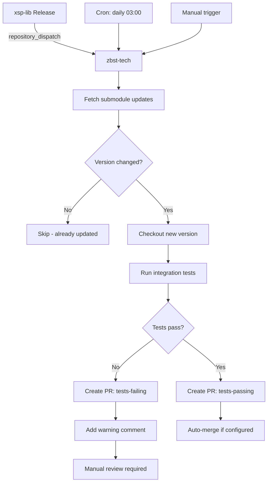

# Submodule Auto-Update Setup

Для репозиториев, использующих `xsp-lib` как **git submodule** (например, `zbst-tech`).

## 🎯 Два режима обновления

### 1. Scheduled (ежедневная проверка)
- Cron: каждый день в 03:00 MSK
- Обновляет до последнего stable tag

### 2. Instant (triggered by xsp-lib release)
- Срабатывает при релизе xsp-lib
- Получает конкретную версию из payload
- Мгновенное обновление

## 📝 Workflow для родительского репо

Создай `.github/workflows/update-submodules.yml` в **zbst-tech** (или другом родительском репо):

```yaml
name: Update Submodules

on:
  schedule:
    # Ежедневно в 03:00 UTC (06:00 MSK)
    - cron: '0 3 * * *'
  repository_dispatch:
    types: [submodule-update]
  workflow_dispatch:
    inputs:
      submodule:
        description: 'Submodule path (e.g., xsp-lib) or "all"'
        required: false
        default: 'all'
      version:
        description: 'Target version/tag (empty = latest)'
        required: false
        default: ''

permissions:
  contents: write
  pull-requests: write
  issues: write

jobs:
  update-submodules:
    runs-on: ubuntu-latest
    
    steps:
      - name: Checkout with submodules
        uses: actions/checkout@v4
        with:
          submodules: recursive
          fetch-depth: 0
          token: ${{ secrets.GITHUB_TOKEN }}

      - name: Configure git
        run: |
          git config user.name "github-actions[bot]"
          git config user.email "github-actions[bot]@users.noreply.github.com"

      - name: Determine target submodules
        id: targets
        run: |
          if [ "${{ github.event_name }}" == "repository_dispatch" ]; then
            # Triggered by xsp-lib release
            SUBMODULE="${{ github.event.client_payload.submodule_path }}"
            VERSION="${{ github.event.client_payload.version }}"
            TRIGGER="release"
          elif [ -n "${{ inputs.submodule }}" ]; then
            # Manual trigger
            SUBMODULE="${{ inputs.submodule }}"
            VERSION="${{ inputs.version }}"
            TRIGGER="manual"
          else
            # Scheduled
            SUBMODULE="all"
            VERSION=""
            TRIGGER="scheduled"
          fi
          
          echo "submodule=$SUBMODULE" >> $GITHUB_OUTPUT
          echo "version=$VERSION" >> $GITHUB_OUTPUT
          echo "trigger=$TRIGGER" >> $GITHUB_OUTPUT
          
          echo "🎯 Target: $SUBMODULE (version: ${VERSION:-latest})"

      - name: Update xsp-lib submodule
        id: update_xsp
        if: steps.targets.outputs.submodule == 'xsp-lib' || steps.targets.outputs.submodule == 'all'
        run: |
          SUBMODULE_PATH="xsp-lib"  # Adjust if different
          
          if [ ! -d "$SUBMODULE_PATH" ]; then
            echo "⚠️  Submodule $SUBMODULE_PATH not found"
            echo "has_changes=false" >> $GITHUB_OUTPUT
            exit 0
          fi
          
          cd "$SUBMODULE_PATH"
          
          # Текущая версия
          CURRENT_SHA=$(git rev-parse HEAD)
          CURRENT_TAG=$(git describe --tags --exact-match 2>/dev/null || echo "${CURRENT_SHA:0:7}")
          
          echo "📍 Current: $CURRENT_TAG ($CURRENT_SHA)"
          
          # Fetch latest
          git fetch origin --tags --prune
          
          # Определить целевую версию
          if [ -n "${{ steps.targets.outputs.version }}" ]; then
            TARGET_REF="${{ steps.targets.outputs.version }}"
          else
            # Latest stable tag (vX.Y.Z format)
            TARGET_REF=$(git tag -l 'v[0-9]*' --sort=-version:refname | head -n1)
            if [ -z "$TARGET_REF" ]; then
              TARGET_REF="origin/main"
            fi
          fi
          
          echo "🎯 Target: $TARGET_REF"
          
          # Checkout новой версии
          git checkout "$TARGET_REF"
          NEW_SHA=$(git rev-parse HEAD)
          NEW_TAG=$(git describe --tags --exact-match 2>/dev/null || echo "${NEW_SHA:0:7}")
          
          cd ..
          
          # Git add submodule change
          git add "$SUBMODULE_PATH"
          
          # Проверить есть ли изменения
          if git diff --cached --quiet; then
            echo "has_changes=false" >> $GITHUB_OUTPUT
            echo "✅ Already up to date: $CURRENT_TAG"
          else
            echo "has_changes=true" >> $GITHUB_OUTPUT
            echo "current_version=$CURRENT_TAG" >> $GITHUB_OUTPUT
            echo "new_version=$NEW_TAG" >> $GITHUB_OUTPUT
            echo "current_sha=${CURRENT_SHA:0:7}" >> $GITHUB_OUTPUT
            echo "new_sha=${NEW_SHA:0:7}" >> $GITHUB_OUTPUT
            echo "submodule_path=$SUBMODULE_PATH" >> $GITHUB_OUTPUT
            
            # Get changelog between commits
            CHANGELOG=$(cd "$SUBMODULE_PATH" && git log --oneline "$CURRENT_SHA..$NEW_SHA" | head -n 20)
            echo "changelog<<EOF" >> $GITHUB_OUTPUT
            echo "$CHANGELOG" >> $GITHUB_OUTPUT
            echo "EOF" >> $GITHUB_OUTPUT
            
            echo "📦 Update available: $CURRENT_TAG → $NEW_TAG"
          fi

      - name: Install uv
        if: steps.update_xsp.outputs.has_changes == 'true'
        uses: astral-sh/setup-uv@v5
        with:
          enable-cache: true

      - name: Set up Python
        if: steps.update_xsp.outputs.has_changes == 'true'
        uses: actions/setup-python@v5
        with:
          python-version: '3.12'

      - name: Run integration tests
        if: steps.update_xsp.outputs.has_changes == 'true'
        id: tests
        continue-on-error: true
        run: |
          echo "🧪 Running integration tests with updated submodule..."
          
          # Install parent project dependencies
          uv pip install --system -e .[dev]
          
          # Run tests
          if pytest tests/ --maxfail=3 -v --tb=short; then
            echo "status=passing" >> $GITHUB_OUTPUT
            echo "✅ Tests passed"
          else
            echo "status=failing" >> $GITHUB_OUTPUT
            echo "⚠️  Tests failed"
          fi

      - name: Create Pull Request
        if: steps.update_xsp.outputs.has_changes == 'true'
        id: create_pr
        uses: peter-evans/create-pull-request@v6
        with:
          token: ${{ secrets.GITHUB_TOKEN }}
          commit-message: |
            chore(deps): update xsp-lib submodule ${{ steps.update_xsp.outputs.current_version }} → ${{ steps.update_xsp.outputs.new_version }}
            
            Submodule: ${{ steps.update_xsp.outputs.submodule_path }}
            Commit: ${{ steps.update_xsp.outputs.current_sha }} → ${{ steps.update_xsp.outputs.new_sha }}
            Trigger: ${{ steps.targets.outputs.trigger }}
          branch: auto/update-xsp-lib-${{ steps.update_xsp.outputs.new_sha }}
          delete-branch: true
          title: "⬆️ Update xsp-lib submodule to ${{ steps.update_xsp.outputs.new_version }}"
          body: |
            ## 📦 Submodule Update
            
            **Submodule:** `${{ steps.update_xsp.outputs.submodule_path }}`  
            **Trigger:** ${{ steps.targets.outputs.trigger }}  
            
            | | Current | New |
            |---|---|---|
            | **Version** | `${{ steps.update_xsp.outputs.current_version }}` | `${{ steps.update_xsp.outputs.new_version }}` |
            | **Commit** | `${{ steps.update_xsp.outputs.current_sha }}` | `${{ steps.update_xsp.outputs.new_sha }}` |
            | **Tests** | - | ${{ steps.tests.outputs.status == 'passing' && '✅ Passing' || '⚠️ Failing' }} |
            
            ### 📝 Changes in xsp-lib
            
            <details>
            <summary>Changelog (${{ steps.update_xsp.outputs.current_sha }}..${{ steps.update_xsp.outputs.new_sha }})</summary>
            
            ```
            ${{ steps.update_xsp.outputs.changelog }}
            ```
            
            </details>
            
            ### 🔗 Links
            
            - [Compare commits](https://github.com/pv-udpv/xsp-lib/compare/${{ steps.update_xsp.outputs.current_sha }}...${{ steps.update_xsp.outputs.new_sha }})
            - [xsp-lib releases](https://github.com/pv-udpv/xsp-lib/releases)
            ${{ github.event.client_payload.releaseUrl && format('- [Release notes]({0})', github.event.client_payload.releaseUrl) || '' }}
            
            ### ✅ Checklist
            
            - [ ] Review submodule changes
            - [ ] Verify integration tests (${{ steps.tests.outputs.status }})
            - [ ] Check for breaking changes in xsp-lib API
            - [ ] Update parent code if needed
            - [ ] Test critical user paths
            
            ---
            
            <sub>🤖 Auto-generated by submodule update workflow ([run](https://github.com/${{ github.repository }}/actions/runs/${{ github.run_id }}))</sub>
          labels: |
            dependencies
            submodule
            xsp-lib
            ${{ steps.tests.outputs.status == 'passing' && 'tests-passing' || 'tests-failing' }}
            ${{ steps.targets.outputs.trigger }}
          assignees: ${{ github.repository_owner }}

      - name: Handle test failures
        if: steps.update_xsp.outputs.has_changes == 'true' && steps.tests.outputs.status == 'failing'
        uses: actions/github-script@v7
        with:
          script: |
            // Добавить комментарий в PR о необходимости review
            const prNumber = '${{ steps.create_pr.outputs.pull-request-number }}';
            if (prNumber) {
              await github.rest.issues.createComment({
                owner: context.repo.owner,
                repo: context.repo.repo,
                issue_number: prNumber,
                body: `⚠️ **Integration tests failed**\n\n` +
                  `This submodule update caused test failures. ` +
                  `Please review the changes and fix integration issues before merging.\n\n` +
                  `**Actions:**\n` +
                  `1. Check [test logs](https://github.com/${context.repo.owner}/${context.repo.repo}/actions/runs/${context.runId})\n` +
                  `2. Review [xsp-lib changes](https://github.com/pv-udpv/xsp-lib/compare/${{ steps.update_xsp.outputs.current_sha }}...${{ steps.update_xsp.outputs.new_sha }})\n` +
                  `3. Update parent code to match new xsp-lib API\n` +
                  `4. Re-run tests locally`
              });
            }

      - name: Summary
        if: always()
        run: |
          echo "### 📦 Submodule Update Summary" >> $GITHUB_STEP_SUMMARY
          echo "" >> $GITHUB_STEP_SUMMARY
          echo "**Trigger:** ${{ steps.targets.outputs.trigger }}" >> $GITHUB_STEP_SUMMARY
          echo "**Target:** ${{ steps.targets.outputs.submodule }}" >> $GITHUB_STEP_SUMMARY
          echo "" >> $GITHUB_STEP_SUMMARY
          
          if [ "${{ steps.update_xsp.outputs.has_changes }}" == "true" ]; then
            echo "**Changes detected:**" >> $GITHUB_STEP_SUMMARY
            echo "- xsp-lib: \`${{ steps.update_xsp.outputs.current_version }}\` → \`${{ steps.update_xsp.outputs.new_version }}\`" >> $GITHUB_STEP_SUMMARY
            echo "- Tests: ${{ steps.tests.outputs.status }}" >> $GITHUB_STEP_SUMMARY
            echo "- PR: #${{ steps.create_pr.outputs.pull-request-number }}" >> $GITHUB_STEP_SUMMARY
          else
            echo "✅ No updates available - already at latest version" >> $GITHUB_STEP_SUMMARY
          fi
```

## 🔗 Trigger из xsp-lib при релизе

В `xsp-lib/.github/workflows/release.yml` уже добавлен trigger для обычных репо.  
Добавь также для **submodule-родителей**:

```yaml
- name: Trigger zbst-tech submodule update
  continue-on-error: true
  uses: peter-evans/repository-dispatch@v3
  with:
    token: ${{ secrets.CASCADE_PAT }}
    repository: pv-udpv/zbst-tech  # или другой родительский репо
    event-type: submodule-update
    client-payload: |
      {
        "submodule_path": "xsp-lib",
        "version": "${{ steps.release_info.outputs.version }}",
        "changelog": ${{ steps.release_info.outputs.changelog }},
        "triggeredBy": "${{ github.repository }}",
        "releaseUrl": "${{ github.event.release.html_url }}"
      }
```

## 🎯 Workflow диаграмма



## 🚀 Setup для zbst-tech

```bash
# 1. В zbst-tech создать workflow
mkdir -p .github/workflows
curl -o .github/workflows/update-submodules.yml \
  https://raw.githubusercontent.com/pv-udpv/xsp-lib/main/.github/SUBMODULE_PARENT_TEMPLATE.md

# Или скопировать вручную workflow из этого файла

# 2. Настроить CASCADE_PAT в xsp-lib (если еще не настроен)
gh secret set CASCADE_PAT --repo pv-udpv/xsp-lib

# 3. В xsp-lib/.github/workflows/release.yml добавить trigger для zbst-tech
# (см. секцию выше)

# 4. Test workflow
gh workflow run update-submodules.yml \
  --repo pv-udpv/zbst-tech \
  -f submodule=xsp-lib
```

## 📋 Особенности для submodules

### vs обычные dependencies:

| Аспект | Submodule | Dependency (pip) |
|--------|-----------|------------------|
| **Update** | `git checkout tag` | `uv pip install` |
| **Lock** | Commit SHA в родителе | requirements.txt |
| **Tests** | Integration tests critical | Unit tests обычно достаточно |
| **Rollback** | `git reset submodule` | `uv pip install old-version` |
| **CI overhead** | Выше (recursive checkout) | Ниже |

### Рекомендации:

1. **Always run integration tests** - submodule changes более критичны
2. **Pin to tags, not commits** - легче track версии
3. **Don't auto-merge** - даже если тесты зелёные, review обязателен
4. **Monitor main branch** - daily cron поймёт unreleased changes

## 🔧 Advanced: Несколько submodules

Если в zbst-tech несколько submodules (например, `xsp-lib`, `utils-lib`):

```yaml
# В update-submodules.yml добавить matrix strategy:
jobs:
  update-submodules:
    strategy:
      matrix:
        submodule:
          - path: xsp-lib
            repo: pv-udpv/xsp-lib
          - path: utils-lib
            repo: pv-udpv/utils-lib
      fail-fast: false
    
    steps:
      # ... используй ${{ matrix.submodule.path }}
```

## 📊 Сравнение стратегий для zbst-tech

| Стратегия | Pros | Cons | Рекомендация |
|-----------|------|------|-------------|
| **Submodule** | Точный контроль версии, локальная разработка | Сложнее CI, требует recursive checkout | ✅ Если разрабатываешь xsp-lib и zbst-tech параллельно |
| **Pip dependency** | Проще CI, стандартный Python workflow | Нет локальной разработки, зависишь от PyPI | ✅ Если xsp-lib стабилен, редкие изменения |
| **Monorepo** | Атомарные изменения, один CI | Сложнее разделение concerns | ⚠️ Если проекты очень связаны |

---

**Статус:** Ready for production ✅  
**Tested with:** Git submodules, GitHub Actions, UV  
**Last updated:** 2025-12-14
