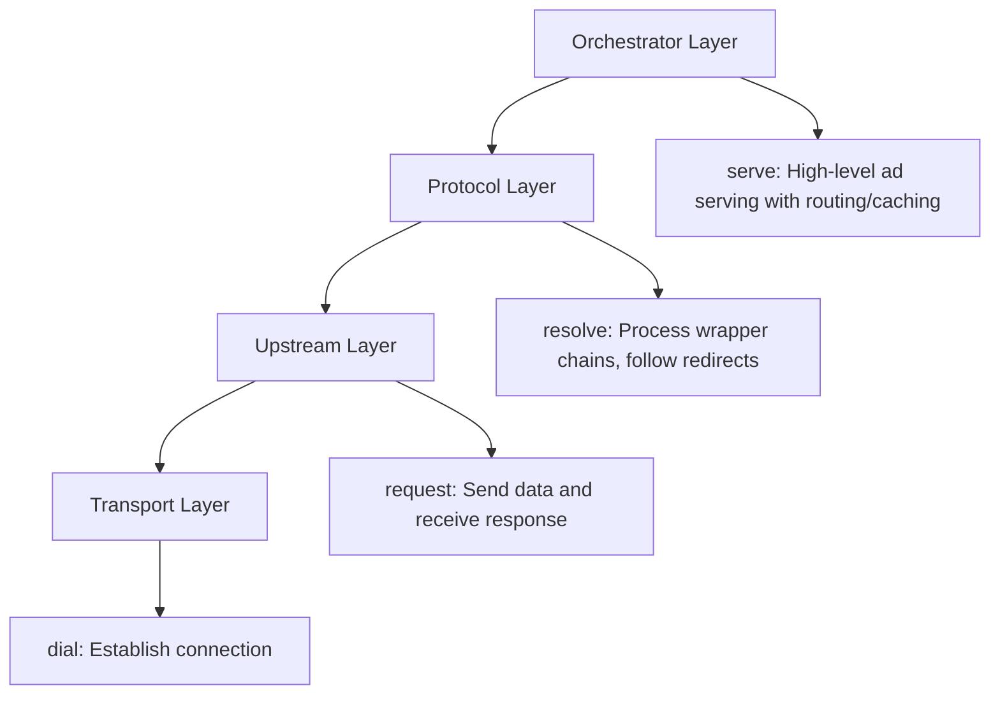
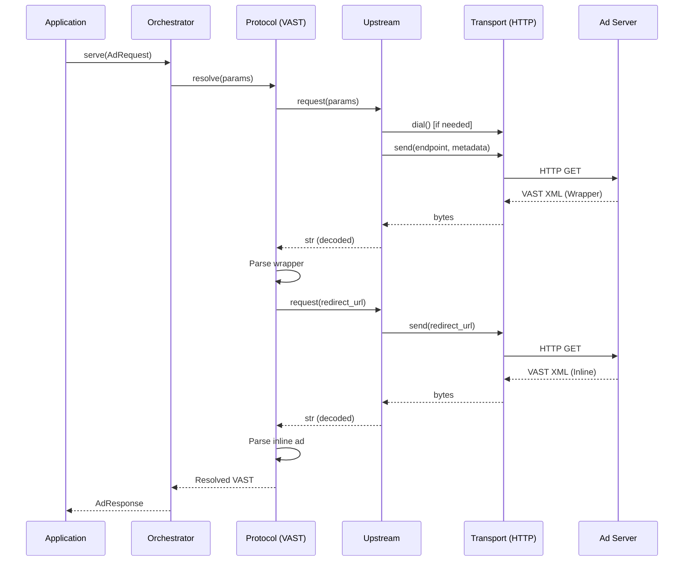
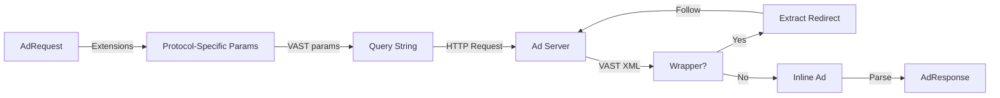

# Final Architecture

**xsp-lib** is a comprehensive AdTech service protocol library built on layered, protocol-agnostic abstractions that enable robust, type-safe integration with advertising systems.

## Overview

The library follows a four-layer architecture that separates concerns and enables maximum flexibility:



## System Layers

### Layer 1: Transport - Connection Management

The **Transport** layer handles low-level I/O operations and connection management. It abstracts away the specifics of different communication protocols.

**Responsibility**: Establish connections (`dial`) and transmit bytes

**Protocol Definition**:

```python
from typing import Protocol
from enum import Enum

class TransportType(str, Enum):
    """Supported transport types."""
    HTTP = "http"
    HTTPS = "https"
    GRPC = "grpc"
    WEBSOCKET = "websocket"
    FILE = "file"
    MEMORY = "memory"
    S3 = "s3"

class Transport(Protocol):
    """Transport layer protocol."""
    
    @property
    def transport_type(self) -> TransportType:
        """Return the transport type."""
        ...
    
    async def send(
        self,
        endpoint: str,
        payload: bytes | None = None,
        metadata: dict[str, str] | None = None,
        timeout: float | None = None,
    ) -> bytes:
        """Send a request and return the response."""
        ...
    
    async def close(self) -> None:
        """Close the transport and release resources."""
        ...
```

**Implementations**:

- **HttpTransport**: HTTP/HTTPS requests using `aiohttp`
- **GrpcTransport**: gRPC channel management (future)
- **WebSocketTransport**: WebSocket connections (future)
- **FileTransport**: File system I/O for testing
- **MemoryTransport**: In-memory storage for testing
- **S3Transport**: AWS S3 object storage (future)

**Example - HTTP Transport**:

```python
from xsp.transports.http import HttpTransport

# Dial (establish connection pool)
transport = HttpTransport()

# Send request
response_bytes = await transport.send(
    endpoint="https://ad-server.example.com/vast",
    metadata={"User-Agent": "xsp-lib/1.0"}
)

# Close (release connection pool)
await transport.close()
```

**Key Concepts**:

- **dial()**: Metaphor for establishing connection (HTTP client, gRPC channel)
- **Stateless**: Each `send()` is independent
- **Byte-oriented**: Works only with `bytes`, no knowledge of protocols

### Layer 2: Upstream - Request/Response Exchange

The **Upstream** layer adds semantics to transport operations, handling serialization, parameter management, and error handling.

**Responsibility**: Send structured requests (`request`) and decode responses

**Protocol Definition**:

```python
from typing import Protocol, TypeVar, Any

T = TypeVar("T", covariant=True)

class Upstream(Protocol[T]):
    """Universal upstream service protocol."""
    
    async def fetch(
        self,
        *,
        params: dict[str, Any] | None = None,
        headers: dict[str, str] | None = None,
        context: dict[str, Any] | None = None,
        timeout: float | None = None,
        **kwargs: Any,
    ) -> T:
        """Fetch data from upstream."""
        ...
    
    async def close(self) -> None:
        """Release resources."""
        ...
    
    async def health_check(self) -> bool:
        """Check upstream health."""
        ...
```

**Base Implementation**:

```python
from typing import Generic, TypeVar, Callable, Any
from xsp.core.transport import Transport

T = TypeVar("T")

class BaseUpstream(Generic[T]):
    """
    Base upstream implementation.
    
    Composes:
    - Transport layer for I/O
    - Decoder for response deserialization
    - Optional encoder for request serialization
    """
    
    def __init__(
        self,
        transport: Transport,
        decoder: Callable[[bytes], T],
        *,
        encoder: Callable[[Any], bytes] | None = None,
        endpoint: str = "",
        default_params: dict[str, Any] | None = None,
        default_headers: dict[str, str] | None = None,
        default_timeout: float = 30.0,
    ):
        self.transport = transport
        self.decoder = decoder
        self.encoder = encoder
        self.endpoint = endpoint
        self.default_params = default_params or {}
        self.default_headers = default_headers or {}
        self.default_timeout = default_timeout
    
    async def fetch(
        self,
        *,
        params: dict[str, Any] | None = None,
        headers: dict[str, str] | None = None,
        timeout: float | None = None,
        **kwargs: Any,
    ) -> T:
        """Send request and decode response."""
        # Merge parameters
        merged_params = {**self.default_params, **(params or {})}
        merged_headers = {**self.default_headers, **(headers or {})}
        
        # Transport send
        response_bytes = await self.transport.send(
            endpoint=self.endpoint,
            metadata=merged_headers,
            timeout=timeout or self.default_timeout
        )
        
        # Decode response
        return self.decoder(response_bytes)
```

**Example - JSON API Upstream**:

```python
import json
from xsp.core.base import BaseUpstream
from xsp.transports.http import HttpTransport

# Create upstream with JSON decoder
upstream = BaseUpstream(
    transport=HttpTransport(),
    decoder=lambda b: json.loads(b.decode('utf-8')),
    endpoint="https://api.example.com/data",
    default_headers={"Content-Type": "application/json"}
)

# Request data
result = await upstream.fetch(params={"id": "123"})
```

**Key Concepts**:

- **request()**: Terminology for data exchange (deprecated: `fetch()`)
- **Type-safe**: Generic over response type `T`
- **Composable**: Transport + Decoder pattern
- **Stateless**: No session state maintained

### Layer 3: Protocol - Domain Logic

The **Protocol** layer implements AdTech-specific logic like VAST wrapper resolution, OpenRTB bid parsing, and macro substitution.

**Responsibility**: Process protocol-specific semantics (`resolve`)

**VAST Protocol Example**:

```python
from xsp.core.base import BaseUpstream
from xsp.transports.http import HttpTransport
import xml.etree.ElementTree as ET

class VastUpstream(BaseUpstream[str]):
    """VAST protocol implementation."""
    
    def __init__(
        self,
        transport: Transport,
        endpoint: str,
        *,
        version: VastVersion = VastVersion.V4_2,
        enable_macros: bool = True,
        max_wrapper_depth: int = 5,
        **kwargs
    ):
        super().__init__(
            transport=transport,
            decoder=lambda b: b.decode('utf-8'),
            endpoint=endpoint,
            **kwargs
        )
        self.version = version
        self.enable_macros = enable_macros
        self.max_wrapper_depth = max_wrapper_depth
    
    async def resolve_wrappers(self, vast_xml: str) -> str:
        """
        Resolve VAST wrapper chain to inline ad.
        
        This is the 'resolve' operation - following redirects
        per VAST 4.2 §2.4.3.4.
        """
        depth = 0
        current_xml = vast_xml
        
        while depth < self.max_wrapper_depth:
            # Parse XML
            root = ET.fromstring(current_xml)
            
            # Check if wrapper
            wrapper = root.find('.//Wrapper')
            if wrapper is None:
                # Found inline ad
                return current_xml
            
            # Extract redirect URL
            vast_ad_tag_uri = wrapper.find('VASTAdTagURI')
            if vast_ad_tag_uri is None:
                break
            
            # Follow redirect (recursive request)
            next_xml = await self.fetch(endpoint=vast_ad_tag_uri.text)
            current_xml = next_xml
            depth += 1
        
        return current_xml
```

**Example - VAST with Wrapper Resolution**:

```python
from xsp.protocols.vast import VastUpstream, VastVersion
from xsp.transports.http import HttpTransport

# Create VAST upstream
upstream = VastUpstream(
    transport=HttpTransport(),
    endpoint="https://ad-server.example.com/vast",
    version=VastVersion.V4_2,
    enable_macros=True
)

# Request VAST (may return wrapper)
vast_xml = await upstream.fetch(params={"w": "640", "h": "480"})

# Resolve wrappers to inline ad
resolved_xml = await upstream.resolve_wrappers(vast_xml)
```

**Key Concepts**:

- **resolve()**: Protocol-specific operations (wrapper chains, bid parsing)
- **Protocol-aware**: Understands VAST, OpenRTB, etc.
- **Stateful processing**: May require multiple upstream requests
- **Extends Upstream**: Built on top of BaseUpstream

### Layer 4: Orchestrator - Application Logic

The **Orchestrator** layer provides high-level ad serving with routing, caching, session management, and business logic.

**Responsibility**: Coordinate multiple upstreams (`serve`)

**Future Design** (not yet implemented):

```python
from typing import Protocol

class AdOrchestrator(Protocol):
    """High-level ad serving orchestrator."""
    
    async def serve(
        self,
        request: AdRequest,
        session: SessionContext,
    ) -> AdResponse:
        """
        Serve ad with full orchestration.
        
        This is the 'serve' operation - high-level coordination
        with routing, caching, and session management.
        """
        ...
```

**Example - Future Orchestrator Usage**:

```python
# Create orchestrator with routing
orchestrator = AdOrchestrator(
    upstreams={
        "vast": vast_upstream,
        "openrtb": openrtb_upstream,
    },
    cache=RedisCache(),
    router=AdRouter()
)

# Serve ad (orchestrator handles routing, caching, sessions)
response = await orchestrator.serve(
    request=AdRequest(
        user_id="user123",
        width=640,
        height=480,
        format="vast"
    ),
    session=session_context
)
```

**Key Concepts**:

- **serve()**: High-level ad serving with full orchestration
- **Multi-upstream**: Routes to appropriate upstream
- **Caching**: Response and session caching
- **Business logic**: Frequency capping, budget tracking

## Component Interaction

### Request Flow Diagram



### Data Flow



**AdRequest → VAST Params**:

```python
# Generic AdRequest
ad_request = AdRequest(
    user_id="user123",
    width=640,
    height=480,
    extensions={
        "vast": {
            "version": "4.2",
            "playerVersion": "1.0",
            "gdpr": "1"
        }
    }
)

# Protocol layer converts to VAST-specific params
vast_params = {
    "userId": ad_request.user_id,
    "w": ad_request.width,
    "h": ad_request.height,
    "pv": ad_request.extensions["vast"]["playerVersion"],
    "gdpr": ad_request.extensions["vast"]["gdpr"]
}

# Upstream layer builds query string
# Transport layer sends HTTP request
```

**Wrapper Resolution**:

```python
# Initial request returns wrapper
wrapper_xml = await upstream.fetch(params=vast_params)

# Parse wrapper
root = ET.fromstring(wrapper_xml)
redirect_url = root.find('.//VASTAdTagURI').text

# Follow redirect
inline_xml = await upstream.fetch(endpoint=redirect_url)

# Return resolved inline ad
```

**AdResponse Construction**:

```python
# Parse inline VAST
root = ET.fromstring(inline_xml)
ad_response = AdResponse(
    ad_id=root.find('.//Ad').get('id'),
    ad_title=root.find('.//AdTitle').text,
    duration=root.find('.//Duration').text,
    media_files=[
        MediaFile(
            url=mf.text,
            mime_type=mf.get('type'),
            width=int(mf.get('width')),
            height=int(mf.get('height'))
        )
        for mf in root.findall('.//MediaFile')
    ]
)
```

## Correct Terminology

The architecture uses precise terminology to clarify the role of each layer:

| Term | Layer | Meaning | Example |
|------|-------|---------|---------|
| **dial()** | Transport | Establish connection (HTTP client, gRPC channel) | `transport = HttpTransport()` creates connection pool |
| **send()** | Transport | Transmit bytes over connection | `await transport.send(endpoint, payload)` |
| **request()** | Upstream | Send structured data and receive response | `result = await upstream.fetch(params=...)` |
| **resolve()** | Protocol | Process wrapper chains, follow redirects | `resolved = await vast.resolve_wrappers(xml)` |
| **serve()** | Orchestrator | High-level ad serving with routing/caching | `response = await orchestrator.serve(request)` |
| **fetch()** | **DEPRECATED** | Old name for request(), kept for compatibility | Use `request()` in new code |

**Terminology in Practice**:

```python
# Layer 1: Transport - dial and send
transport = HttpTransport()  # dial: establish connection pool
await transport.send(endpoint, metadata)  # send: transmit bytes

# Layer 2: Upstream - request
upstream = BaseUpstream(transport=transport, decoder=...)
result = await upstream.fetch(params=...)  # request: structured exchange

# Layer 3: Protocol - resolve
vast_upstream = VastUpstream(transport=transport, endpoint=...)
xml = await vast_upstream.fetch(params=...)  # request
resolved = await vast_upstream.resolve_wrappers(xml)  # resolve: follow wrappers

# Layer 4: Orchestrator - serve
orchestrator = AdOrchestrator(upstreams=...)
response = await orchestrator.serve(request, session)  # serve: full orchestration
```

## Middleware System

Middleware wraps upstreams to add cross-cutting concerns like retry, circuit breaking, caching, and metrics.

**Architecture**:


**Middleware Protocol**:

```python
from typing import Protocol, Any, Callable, Awaitable

FetchFunc = Callable[..., Awaitable[Any]]

class Middleware(Protocol):
    """Middleware for upstream requests."""
    
    async def __call__(
        self,
        upstream: Upstream[Any],
        next_handler: FetchFunc,
        **kwargs: Any
    ) -> Any:
        """Process request through middleware."""
        ...
```

**Example - Retry Middleware**:

```python
import asyncio

class RetryMiddleware:
    """Retry failed requests with exponential backoff."""
    
    def __init__(
        self,
        max_attempts: int = 3,
        backoff_base: float = 2.0,
        retriable_errors: tuple[type[Exception], ...] = (TransportError,)
    ):
        self.max_attempts = max_attempts
        self.backoff_base = backoff_base
        self.retriable_errors = retriable_errors
    
    async def __call__(
        self,
        upstream: Upstream[Any],
        next_handler: FetchFunc,
        **kwargs: Any
    ) -> Any:
        """Execute request with retry logic."""
        last_error = None
        
        for attempt in range(self.max_attempts):
            try:
                return await next_handler(**kwargs)
            except self.retriable_errors as e:
                last_error = e
                if attempt < self.max_attempts - 1:
                    delay = self.backoff_base ** attempt
                    await asyncio.sleep(delay)
        
        raise last_error
```

**Middleware Stack Usage**:

```python
from xsp.middleware.base import MiddlewareStack
from xsp.middleware.retry import RetryMiddleware

# Create base upstream
base_upstream = VastUpstream(
    transport=HttpTransport(),
    endpoint="https://ad-server.example.com/vast"
)

# Wrap with middleware
middleware = MiddlewareStack(
    RetryMiddleware(max_attempts=3, backoff_base=2.0)
)
upstream = middleware.wrap(base_upstream)

# Use wrapped upstream (retry automatically applied)
result = await upstream.fetch(params={"w": "640", "h": "480"})
```

## Session Management Integration

Session management tracks state across multiple ad requests for features like frequency capping and budget tracking.

**Session Architecture** (see [session-management.md](./session-management.md) for details):

- **SessionContext**: Immutable request context (user ID, device info)
- **UpstreamSession**: Stateful protocol with state updates
- **StateBackend**: Persistent storage (Redis, DynamoDB, etc.)

**Integration with Upstream**:

```python
# Create upstream with session support (future)
upstream = VastUpstream(
    transport=HttpTransport(),
    endpoint="https://ad-server.example.com/vast",
    state_backend=RedisStateBackend()
)

# Request with session context
response = await upstream.fetch(
    params={"w": "640", "h": "480"},
    session=SessionContext(
        user_id="user123",
        session_id="sess456"
    )
)

# Session state automatically updated
# - Impression count incremented
# - Budget decremented
# - Frequency cap checked
```

## State Backend Architecture

State backends provide persistent storage for session data:

**Backend Protocol** (future):

```python
from typing import Protocol, Any

class StateBackend(Protocol):
    """State storage backend."""
    
    async def get(self, key: str) -> dict[str, Any] | None:
        """Get state by key."""
        ...
    
    async def set(self, key: str, value: dict[str, Any]) -> None:
        """Set state by key."""
        ...
    
    async def increment(self, key: str, field: str, amount: int = 1) -> int:
        """Increment field atomically."""
        ...
    
    async def close(self) -> None:
        """Close backend connection."""
        ...
```

**Implementations**:

- **RedisStateBackend**: Redis-based storage
- **DynamoDBStateBackend**: AWS DynamoDB storage
- **MemoryStateBackend**: In-memory storage for testing

## Error Handling

The library uses a hierarchical exception system:

```python
class XspError(Exception):
    """Base exception for xsp-lib."""

class TransportError(XspError):
    """Transport layer errors."""

class UpstreamError(XspError):
    """Upstream layer errors."""

class UpstreamTimeout(UpstreamError):
    """Request timeout."""

class DecodeError(UpstreamError):
    """Response decoding error."""

class ProtocolError(XspError):
    """Protocol layer errors."""

class VastError(ProtocolError):
    """VAST protocol errors."""

class OpenRtbError(ProtocolError):
    """OpenRTB protocol errors."""
```

**Error Handling Example**:

```python
from xsp.core.exceptions import TransportError, DecodeError, VastError

try:
    result = await vast_upstream.fetch(params={"w": "640", "h": "480"})
    resolved = await vast_upstream.resolve_wrappers(result)
except TransportError as e:
    # Network error - retry or fallback
    logger.error(f"Transport error: {e}")
except DecodeError as e:
    # Invalid response format
    logger.error(f"Decode error: {e}")
except VastError as e:
    # VAST protocol error
    logger.error(f"VAST error: {e}")
```

## Testing Architecture

The library provides comprehensive testing utilities:

**Transport Mocking**:

```python
from xsp.transports.memory import MemoryTransport

# Mock VAST response
sample_vast = """<?xml version="1.0"?>
<VAST version="4.2">
  <Ad id="123">
    <InLine>...</InLine>
  </Ad>
</VAST>"""

transport = MemoryTransport(sample_vast.encode('utf-8'))
upstream = VastUpstream(transport=transport, endpoint="memory://vast")

# Test with mock transport
result = await upstream.fetch()
assert "VAST" in result
```

**File-based Testing**:

```python
from xsp.transports.file import FileTransport

# Load test data from file
transport = FileTransport()
upstream = BaseUpstream(
    transport=transport,
    decoder=lambda b: b.decode('utf-8'),
    endpoint="/path/to/test/vast.xml"
)

result = await upstream.fetch()
```

## Design Principles

### 1. Composability

Components are small and focused, composing to build complex functionality:

```python
# Compose: Transport + Decoder = Upstream
upstream = BaseUpstream(
    transport=HttpTransport(),
    decoder=json_decoder
)

# Compose: Upstream + Middleware = Enhanced Upstream
enhanced = middleware_stack.wrap(upstream)

# Compose: Protocol + Session = Stateful Protocol
stateful = VastUpstream(
    transport=transport,
    state_backend=redis_backend
)
```

### 2. Type Safety

Full type hints with strict mypy compliance:

```python
# Generic upstream over response type
class BaseUpstream(Generic[T]):
    def __init__(self, decoder: Callable[[bytes], T]): ...
    async def fetch(self) -> T: ...

# Type-safe usage
str_upstream: BaseUpstream[str] = BaseUpstream(
    decoder=lambda b: b.decode('utf-8')
)
result: str = await str_upstream.fetch()

dict_upstream: BaseUpstream[dict] = BaseUpstream(
    decoder=json.loads
)
result_dict: dict = await dict_upstream.fetch()
```

### 3. Testability

Pluggable transports enable easy testing without network I/O:

```python
# Production: HTTP transport
prod_upstream = VastUpstream(
    transport=HttpTransport(),
    endpoint="https://ad-server.example.com/vast"
)

# Testing: Memory transport
test_upstream = VastUpstream(
    transport=MemoryTransport(sample_vast.encode('utf-8')),
    endpoint="memory://vast"
)

# Same interface, different behavior
```

### 4. Extensibility

Protocol-based design allows custom implementations:

```python
# Custom transport
class CustomTransport:
    @property
    def transport_type(self) -> TransportType:
        return TransportType.CUSTOM
    
    async def send(self, endpoint: str, ...) -> bytes:
        # Custom implementation
        ...

# Works with any upstream
upstream = BaseUpstream(
    transport=CustomTransport(),
    decoder=...
)
```

### 5. Production Ready

Built-in error handling, timeouts, and retries:

```python
# Timeout handling
upstream = BaseUpstream(
    transport=transport,
    decoder=decoder,
    default_timeout=10.0
)

# Retry middleware
middleware = MiddlewareStack(
    RetryMiddleware(max_attempts=3)
)
upstream = middleware.wrap(base_upstream)

# Health checks
is_healthy = await upstream.health_check()
```

## Directory Structure

```
src/xsp/
├── core/                   # Core abstractions
│   ├── upstream.py        # Upstream protocol
│   ├── transport.py       # Transport protocol
│   ├── base.py            # BaseUpstream implementation
│   ├── types.py           # Common type definitions
│   └── exceptions.py      # Exception hierarchy
├── transports/            # Transport implementations
│   ├── http.py            # HTTP/HTTPS transport
│   ├── file.py            # File system transport
│   ├── memory.py          # In-memory transport
│   ├── grpc.py            # gRPC transport (future)
│   └── websocket.py       # WebSocket transport (future)
├── middleware/            # Middleware system
│   ├── base.py            # Middleware protocol and stack
│   ├── retry.py           # Retry middleware
│   ├── circuit_breaker.py # Circuit breaker (future)
│   ├── cache.py           # Cache middleware (future)
│   └── metrics.py         # Metrics middleware (future)
├── protocols/             # Protocol implementations
│   ├── vast/              # VAST protocol
│   ├── openrtb/           # OpenRTB protocol
│   ├── daast/             # DAAST protocol (deprecated)
│   └── cats/              # CATS protocol (future)
├── standards/             # Industry standards
│   ├── adcom/             # AdCOM standard
│   └── opendirect/        # OpenDirect (future)
├── schemas/               # Validation and schemas
│   ├── vast/              # VAST XSD schemas
│   └── openrtb/           # OpenRTB JSON schemas
└── utils/                 # Utilities
    ├── macros.py          # IAB macro substitution
    └── validation.py      # Schema validation
```

## Related Documentation

- [Session Management Architecture](./architecture-session-management.md)
- [Terminology Reference](./architecture-terminology.md)
- [Protocol-Agnostic Design](./architecture-protocol-agnostic-design.md)
- [VAST Protocol Documentation](./protocols/vast.md)
- [Quick Start Guide](./quickstart.md)
