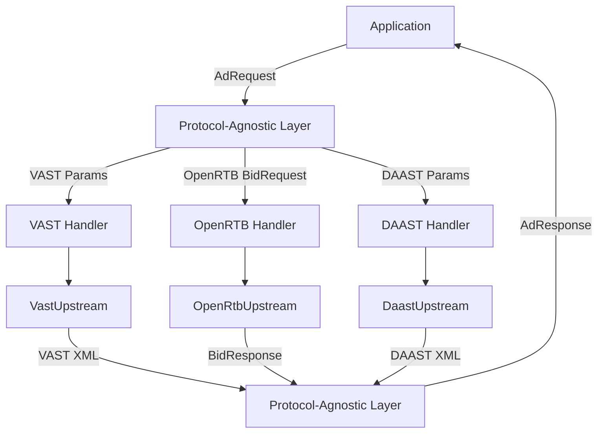

# Protocol-Agnostic Design

**xsp-lib** uses a protocol-agnostic architecture that enables unified handling of diverse AdTech protocols (VAST, OpenRTB, DAAST, etc.) through common abstractions.

## Overview

The protocol-agnostic design provides:

1. **Common Schemas**: TypedDict-based `AdRequest` and `AdResponse` schemas
2. **Extension Pattern**: `extensions` field for protocol-specific data
3. **Protocol Handlers**: Interface for converting between generic and protocol-specific formats
4. **Backward Compatibility**: Smooth migration path from protocol-specific to generic APIs



## Core Schemas

### AdRequest Schema

**AdRequest** is a generic request schema that supports all AdTech protocols through a common structure plus extensions.

```python
from typing import TypedDict, NotRequired, Any, Literal

class AdRequest(TypedDict):
    """
    Protocol-agnostic ad request.
    
    Common fields map to all protocols:
    - VAST: Query parameters
    - OpenRTB: BidRequest fields
    - DAAST: Audio ad parameters
    
    Protocol-specific data goes in extensions.
    """
    
    # Request identification
    request_id: str
    timestamp: int  # Unix timestamp in milliseconds
    
    # User identification
    user_id: NotRequired[str]
    device_id: NotRequired[str]
    ip_address: NotRequired[str]
    
    # Ad placement
    placement_id: NotRequired[str]
    publisher_id: NotRequired[str]
    site_url: NotRequired[str]
    
    # Creative dimensions
    width: NotRequired[int]
    height: NotRequired[int]
    
    # Media type
    media_type: NotRequired[Literal["video", "audio", "display", "native"]]
    
    # Content context
    content_url: NotRequired[str]
    content_title: NotRequired[str]
    content_duration: NotRequired[int]  # seconds
    
    # Device information
    device_type: NotRequired[Literal["mobile", "tablet", "desktop", "ctv"]]
    device_make: NotRequired[str]
    device_model: NotRequired[str]
    os: NotRequired[str]
    os_version: NotRequired[str]
    
    # Geo information
    country: NotRequired[str]  # ISO 3166-1 alpha-2
    region: NotRequired[str]
    city: NotRequired[str]
    zip_code: NotRequired[str]
    lat: NotRequired[float]
    lon: NotRequired[float]
    
    # Privacy/Consent
    gdpr: NotRequired[bool]
    gdpr_consent: NotRequired[str]
    ccpa: NotRequired[bool]
    coppa: NotRequired[bool]
    
    # Timeout
    timeout: NotRequired[float]  # seconds
    
    # Protocol-specific extensions
    extensions: NotRequired[dict[str, Any]]
```

### AdResponse Schema

**AdResponse** is a generic response schema containing common ad data plus protocol-specific extensions.

```python
from typing import TypedDict, NotRequired, Any, Literal

class MediaFile(TypedDict):
    """Media file information."""
    url: str
    mime_type: str
    width: NotRequired[int]
    height: NotRequired[int]
    bitrate: NotRequired[int]
    delivery: NotRequired[Literal["progressive", "streaming"]]

class TrackingEvent(TypedDict):
    """Tracking event URL."""
    event_type: str  # "impression", "start", "firstQuartile", "midpoint", etc.
    url: str

class AdResponse(TypedDict):
    """
    Protocol-agnostic ad response.
    
    Common fields extracted from all protocols:
    - VAST: Parsed XML elements
    - OpenRTB: BidResponse fields
    - DAAST: Audio ad data
    
    Raw protocol response available in extensions.
    """
    
    # Response identification
    response_id: str
    request_id: str  # Matches AdRequest.request_id
    timestamp: int
    
    # Ad identification
    ad_id: str
    campaign_id: NotRequired[str]
    creative_id: NotRequired[str]
    
    # Ad metadata
    ad_title: NotRequired[str]
    ad_description: NotRequired[str]
    advertiser_name: NotRequired[str]
    
    # Media
    media_files: NotRequired[list[MediaFile]]
    duration: NotRequired[int]  # seconds
    
    # Click handling
    click_through_url: NotRequired[str]
    click_tracking_urls: NotRequired[list[str]]
    
    # Tracking
    impression_urls: list[str]
    tracking_events: NotRequired[list[TrackingEvent]]
    error_urls: NotRequired[list[str]]
    
    # Pricing (OpenRTB)
    price: NotRequired[float]  # CPM in dollars
    currency: NotRequired[str]  # ISO 4217
    
    # Protocol-specific data
    protocol: Literal["vast", "openrtb", "daast", "custom"]
    extensions: NotRequired[dict[str, Any]]
```

## Extension Pattern

The `extensions` field provides a structured way to include protocol-specific data while maintaining type safety.

### Extension Structure

```python
# VAST extensions
vast_extensions = {
    "vast": {
        "version": "4.2",
        "ad_type": "video",  # or "audio" for DAAST
        "wrapper_depth": 2,
        "verification": {
            "vendor": "IAS",
            "script_url": "https://verify.example.com/script.js"
        },
        "raw_xml": "<VAST>...</VAST>"
    }
}

# OpenRTB extensions
openrtb_extensions = {
    "openrtb": {
        "version": "2.6",
        "bid_id": "bid123",
        "seat_bid_id": "seat456",
        "deal_id": "deal789",
        "raw_response": {...}  # Full BidResponse object
    }
}

# DAAST extensions (VAST with audio)
daast_extensions = {
    "vast": {
        "version": "4.1",
        "ad_type": "audio",
        "audio_codec": "mp3",
        "sample_rate": 44100,
        "raw_xml": "<VAST>...</VAST>"
    }
}
```

### Typed Extension Schemas

Define TypedDict schemas for extensions:

```python
class VastExtensions(TypedDict):
    """VAST-specific extensions."""
    version: str  # "3.0", "4.0", "4.1", "4.2"
    ad_type: Literal["video", "audio"]
    wrapper_depth: NotRequired[int]
    verification: NotRequired[dict[str, Any]]
    raw_xml: NotRequired[str]

class OpenRtbExtensions(TypedDict):
    """OpenRTB-specific extensions."""
    version: str  # "2.6", "3.0"
    bid_id: str
    seat_bid_id: NotRequired[str]
    deal_id: NotRequired[str]
    raw_response: NotRequired[dict[str, Any]]

# Use in AdRequest/AdResponse
request_with_vast: AdRequest = {
    "request_id": "req123",
    "timestamp": 1702234567890,
    "width": 640,
    "height": 480,
    "extensions": {
        "vast": VastExtensions({
            "version": "4.2",
            "ad_type": "video"
        })
    }
}
```

## Protocol Handler Interface

Protocol handlers convert between generic `AdRequest`/`AdResponse` and protocol-specific formats.

### Handler Protocol Definition

```python
from typing import Protocol, Generic, TypeVar, Any

TRequest = TypeVar("TRequest")  # Protocol-specific request type
TResponse = TypeVar("TResponse")  # Protocol-specific response type

class ProtocolHandler(Protocol[TRequest, TResponse]):
    """
    Interface for protocol-specific handlers.
    
    Converts between generic AdRequest/AdResponse and protocol-specific formats.
    """
    
    @property
    def protocol_name(self) -> str:
        """Protocol identifier (e.g., 'vast', 'openrtb')."""
        ...
    
    def to_protocol_request(self, ad_request: AdRequest) -> TRequest:
        """
        Convert generic AdRequest to protocol-specific format.
        
        Args:
            ad_request: Generic ad request
        
        Returns:
            Protocol-specific request (e.g., VAST params, OpenRTB BidRequest)
        """
        ...
    
    def from_protocol_response(
        self,
        protocol_response: TResponse,
        ad_request: AdRequest
    ) -> AdResponse:
        """
        Convert protocol-specific response to generic AdResponse.
        
        Args:
            protocol_response: Protocol-specific response
            ad_request: Original ad request for context
        
        Returns:
            Generic ad response
        """
        ...
```

### VAST Handler Implementation

```python
class VastProtocolHandler:
    """Handler for VAST protocol."""
    
    @property
    def protocol_name(self) -> str:
        return "vast"
    
    def to_protocol_request(self, ad_request: AdRequest) -> dict[str, str]:
        """
        Convert AdRequest to VAST query parameters.
        
        Maps generic fields to VAST-specific parameter names per IAB VAST spec.
        """
        params: dict[str, str] = {}
        
        # Dimensions
        if "width" in ad_request:
            params["w"] = str(ad_request["width"])
        if "height" in ad_request:
            params["h"] = str(ad_request["height"])
        
        # User identification
        if "user_id" in ad_request:
            params["userId"] = ad_request["user_id"]
        if "ip_address" in ad_request:
            params["ip"] = ad_request["ip_address"]
        
        # Content context
        if "content_url" in ad_request:
            params["url"] = ad_request["content_url"]
        if "content_duration" in ad_request:
            params["contentDuration"] = str(ad_request["content_duration"])
        
        # Device
        if "device_type" in ad_request:
            params["deviceType"] = ad_request["device_type"]
        
        # Privacy
        if "gdpr" in ad_request:
            params["gdpr"] = "1" if ad_request["gdpr"] else "0"
        if "gdpr_consent" in ad_request:
            params["gdpr_consent"] = ad_request["gdpr_consent"]
        
        # VAST-specific extensions
        if "extensions" in ad_request and "vast" in ad_request["extensions"]:
            vast_ext = ad_request["extensions"]["vast"]
            if "version" in vast_ext:
                params["vastVersion"] = vast_ext["version"]
            if "ad_type" in vast_ext:
                params["adType"] = vast_ext["ad_type"]
        
        return params
    
    def from_protocol_response(
        self,
        vast_xml: str,
        ad_request: AdRequest
    ) -> AdResponse:
        """
        Convert VAST XML to generic AdResponse.
        
        Parses VAST XML and extracts common fields.
        """
        import xml.etree.ElementTree as ET
        
        root = ET.fromstring(vast_xml)
        
        # Extract ad data
        ad = root.find('.//Ad')
        ad_id = ad.get('id') if ad is not None else 'unknown'
        
        inline = root.find('.//InLine')
        ad_title = None
        ad_description = None
        advertiser_name = None
        duration = None
        media_files = []
        impression_urls = []
        click_through_url = None
        
        if inline is not None:
            # Ad metadata
            ad_title_elem = inline.find('AdTitle')
            if ad_title_elem is not None:
                ad_title = ad_title_elem.text
            
            ad_description_elem = inline.find('Description')
            if ad_description_elem is not None:
                ad_description = ad_description_elem.text
            
            ad_system = inline.find('AdSystem')
            if ad_system is not None:
                advertiser_name = ad_system.text
            
            # Impressions
            for imp in inline.findall('Impression'):
                if imp.text:
                    impression_urls.append(imp.text)
            
            # Creative data
            linear = inline.find('.//Linear')
            if linear is not None:
                # Duration
                duration_elem = linear.find('Duration')
                if duration_elem is not None:
                    # Parse HH:MM:SS format
                    parts = duration_elem.text.split(':')
                    duration = int(parts[0]) * 3600 + int(parts[1]) * 60 + int(parts[2])
                
                # Media files
                for mf in linear.findall('.//MediaFile'):
                    media_files.append({
                        "url": mf.text or "",
                        "mime_type": mf.get('type', ''),
                        "width": int(mf.get('width', 0)) if mf.get('width') else None,
                        "height": int(mf.get('height', 0)) if mf.get('height') else None,
                        "bitrate": int(mf.get('bitrate', 0)) if mf.get('bitrate') else None,
                        "delivery": mf.get('delivery')
                    })
                
                # Click through
                click_through = linear.find('.//ClickThrough')
                if click_through is not None and click_through.text:
                    click_through_url = click_through.text
        
        # Build AdResponse
        response: AdResponse = {
            "response_id": f"vast_{ad_id}",
            "request_id": ad_request["request_id"],
            "timestamp": int(time.time() * 1000),
            "ad_id": ad_id,
            "impression_urls": impression_urls,
            "protocol": "vast"
        }
        
        # Optional fields
        if ad_title:
            response["ad_title"] = ad_title
        if ad_description:
            response["ad_description"] = ad_description
        if advertiser_name:
            response["advertiser_name"] = advertiser_name
        if duration:
            response["duration"] = duration
        if media_files:
            response["media_files"] = media_files
        if click_through_url:
            response["click_through_url"] = click_through_url
        
        # Add VAST extensions
        response["extensions"] = {
            "vast": {
                "version": root.get('version', 'unknown'),
                "raw_xml": vast_xml
            }
        }
        
        return response
```

### OpenRTB Handler Implementation

```python
class OpenRtbProtocolHandler:
    """Handler for OpenRTB protocol."""
    
    @property
    def protocol_name(self) -> str:
        return "openrtb"
    
    def to_protocol_request(self, ad_request: AdRequest) -> dict[str, Any]:
        """
        Convert AdRequest to OpenRTB BidRequest.
        
        Maps generic fields to OpenRTB 2.6 structure.
        """
        import uuid
        
        bid_request: dict[str, Any] = {
            "id": ad_request["request_id"],
            "imp": [
                {
                    "id": "1",
                    "video": {} if ad_request.get("media_type") == "video" else None,
                    "audio": {} if ad_request.get("media_type") == "audio" else None,
                    "banner": {} if ad_request.get("media_type") == "display" else None
                }
            ]
        }
        
        # Video/Banner dimensions
        if "width" in ad_request and "height" in ad_request:
            if bid_request["imp"][0]["video"]:
                bid_request["imp"][0]["video"]["w"] = ad_request["width"]
                bid_request["imp"][0]["video"]["h"] = ad_request["height"]
            elif bid_request["imp"][0]["banner"]:
                bid_request["imp"][0]["banner"]["w"] = ad_request["width"]
                bid_request["imp"][0]["banner"]["h"] = ad_request["height"]
        
        # Site
        if "site_url" in ad_request:
            bid_request["site"] = {
                "page": ad_request["site_url"]
            }
            if "publisher_id" in ad_request:
                bid_request["site"]["publisher"] = {
                    "id": ad_request["publisher_id"]
                }
        
        # Device
        device: dict[str, Any] = {}
        if "ip_address" in ad_request:
            device["ip"] = ad_request["ip_address"]
        if "user_agent" in ad_request:
            device["ua"] = ad_request["user_agent"]
        if "device_type" in ad_request:
            device["devicetype"] = {
                "mobile": 1,
                "tablet": 5,
                "desktop": 2,
                "ctv": 3
            }.get(ad_request["device_type"], 0)
        if device:
            bid_request["device"] = device
        
        # User
        if "user_id" in ad_request:
            bid_request["user"] = {
                "id": ad_request["user_id"]
            }
        
        # Geo
        if any(k in ad_request for k in ["country", "region", "city", "lat", "lon"]):
            geo: dict[str, Any] = {}
            if "country" in ad_request:
                geo["country"] = ad_request["country"]
            if "region" in ad_request:
                geo["region"] = ad_request["region"]
            if "city" in ad_request:
                geo["city"] = ad_request["city"]
            if "lat" in ad_request and "lon" in ad_request:
                geo["lat"] = ad_request["lat"]
                geo["lon"] = ad_request["lon"]
            
            if "device" not in bid_request:
                bid_request["device"] = {}
            bid_request["device"]["geo"] = geo
        
        # Privacy
        regs: dict[str, Any] = {}
        if "gdpr" in ad_request:
            regs["gdpr"] = 1 if ad_request["gdpr"] else 0
        if "coppa" in ad_request:
            regs["coppa"] = 1 if ad_request["coppa"] else 0
        if regs:
            bid_request["regs"] = regs
        
        if "gdpr_consent" in ad_request:
            if "user" not in bid_request:
                bid_request["user"] = {}
            bid_request["user"]["consent"] = ad_request["gdpr_consent"]
        
        # OpenRTB extensions
        if "extensions" in ad_request and "openrtb" in ad_request["extensions"]:
            bid_request["ext"] = ad_request["extensions"]["openrtb"]
        
        return bid_request
    
    def from_protocol_response(
        self,
        bid_response: dict[str, Any],
        ad_request: AdRequest
    ) -> AdResponse:
        """Convert OpenRTB BidResponse to generic AdResponse."""
        
        # Extract first bid
        bid = None
        if "seatbid" in bid_response and bid_response["seatbid"]:
            if "bid" in bid_response["seatbid"][0] and bid_response["seatbid"][0]["bid"]:
                bid = bid_response["seatbid"][0]["bid"][0]
        
        if bid is None:
            raise ValueError("No bid in response")
        
        # Build AdResponse
        response: AdResponse = {
            "response_id": bid_response.get("id", "unknown"),
            "request_id": ad_request["request_id"],
            "timestamp": int(time.time() * 1000),
            "ad_id": bid.get("id", "unknown"),
            "impression_urls": [bid["nurl"]] if "nurl" in bid else [],
            "protocol": "openrtb"
        }
        
        # Creative ID
        if "crid" in bid:
            response["creative_id"] = bid["crid"]
        
        # Price
        if "price" in bid:
            response["price"] = bid["price"]
            response["currency"] = bid_response.get("cur", "USD")
        
        # Ad markup
        if "adm" in bid:
            # Check if VAST XML
            if bid["adm"].strip().startswith("<"):
                # VAST XML in adm
                vast_handler = VastProtocolHandler()
                vast_response = vast_handler.from_protocol_response(
                    bid["adm"],
                    ad_request
                )
                # Merge VAST data into response
                if "ad_title" in vast_response:
                    response["ad_title"] = vast_response["ad_title"]
                if "media_files" in vast_response:
                    response["media_files"] = vast_response["media_files"]
                if "duration" in vast_response:
                    response["duration"] = vast_response["duration"]
        
        # Click through
        if "adomain" in bid and bid["adomain"]:
            response["advertiser_name"] = bid["adomain"][0]
        
        # Extensions
        response["extensions"] = {
            "openrtb": {
                "version": "2.6",
                "bid_id": bid.get("id"),
                "raw_response": bid_response
            }
        }
        
        return response
```

## Mapping Examples

### VAST → Generic

```python
# VAST query parameters
vast_params = {
    "w": "640",
    "h": "480",
    "userId": "user123",
    "url": "https://example.com/video",
    "gdpr": "1",
    "gdpr_consent": "consent_string"
}

# Generic AdRequest
ad_request: AdRequest = {
    "request_id": "req_abc123",
    "timestamp": 1702234567890,
    "width": 640,
    "height": 480,
    "user_id": "user123",
    "content_url": "https://example.com/video",
    "gdpr": True,
    "gdpr_consent": "consent_string",
    "media_type": "video",
    "extensions": {
        "vast": {
            "version": "4.2",
            "ad_type": "video"
        }
    }
}

# Use handler
handler = VastProtocolHandler()
vast_params_out = handler.to_protocol_request(ad_request)
```

### OpenRTB → Generic

```python
# OpenRTB BidRequest
bid_request = {
    "id": "req_123",
    "imp": [{
        "id": "1",
        "video": {"w": 640, "h": 480}
    }],
    "site": {
        "page": "https://example.com",
        "publisher": {"id": "pub_456"}
    },
    "device": {
        "ip": "192.168.1.1",
        "ua": "Mozilla/5.0 ...",
        "devicetype": 1
    },
    "user": {
        "id": "user123"
    }
}

# Generic AdRequest
ad_request: AdRequest = {
    "request_id": "req_123",
    "timestamp": 1702234567890,
    "width": 640,
    "height": 480,
    "site_url": "https://example.com",
    "publisher_id": "pub_456",
    "ip_address": "192.168.1.1",
    "user_agent": "Mozilla/5.0 ...",
    "device_type": "mobile",
    "user_id": "user123",
    "media_type": "video"
}
```

### DAAST → Generic (VAST with audio)

```python
# DAAST is VAST 4.1+ with adType="audio"
ad_request: AdRequest = {
    "request_id": "req_audio123",
    "timestamp": 1702234567890,
    "user_id": "user123",
    "media_type": "audio",
    "extensions": {
        "vast": {
            "version": "4.1",
            "ad_type": "audio",  # DAAST indicator
            "audio_codec": "mp3",
            "sample_rate": 44100
        }
    }
}

# Uses same VastProtocolHandler
handler = VastProtocolHandler()
vast_params = handler.to_protocol_request(ad_request)
# Result: {"adType": "audio", ...}
```

## Backward Compatibility Strategy

The protocol-agnostic design maintains backward compatibility with existing protocol-specific APIs.

### Dual API Support

```python
# Old API: Protocol-specific
from xsp.protocols.vast import VastUpstream

vast_upstream = VastUpstream(
    transport=HttpTransport(),
    endpoint="https://ad-server.example.com/vast"
)

vast_xml = await vast_upstream.fetch(params={"w": "640", "h": "480"})

# New API: Protocol-agnostic
from xsp.core.generic import GenericAdUpstream
from xsp.handlers.vast import VastProtocolHandler

generic_upstream = GenericAdUpstream(
    transport=HttpTransport(),
    endpoint="https://ad-server.example.com/vast",
    handler=VastProtocolHandler()
)

ad_request: AdRequest = {
    "request_id": "req123",
    "timestamp": int(time.time() * 1000),
    "width": 640,
    "height": 480
}

ad_response = await generic_upstream.request(ad_request)
```

### Migration Path

**Phase 1**: Protocol-specific APIs (current)
- `VastUpstream`, `OpenRtbUpstream`, etc.
- Direct protocol handling

**Phase 2**: Dual APIs
- Keep protocol-specific APIs
- Add `GenericAdUpstream` with handlers
- Both APIs available

**Phase 3**: Generic-first
- Recommend `GenericAdUpstream` for new code
- Protocol-specific APIs marked as legacy
- Full backward compatibility maintained

**Phase 4**: Protocol-specific as wrappers (future)
- Protocol-specific APIs become thin wrappers over generic
- Implementation consolidation
- API surface unchanged

```python
# Phase 4: VastUpstream wraps GenericAdUpstream
class VastUpstream:
    """Legacy VAST upstream (wraps generic)."""
    
    def __init__(self, transport, endpoint, **kwargs):
        self._generic = GenericAdUpstream(
            transport=transport,
            endpoint=endpoint,
            handler=VastProtocolHandler()
        )
    
    async def fetch(self, params=None, **kwargs):
        """Legacy fetch method."""
        # Convert params to AdRequest
        ad_request = self._params_to_request(params)
        
        # Use generic upstream
        ad_response = await self._generic.request(ad_request)
        
        # Extract VAST XML from extensions
        return ad_response["extensions"]["vast"]["raw_xml"]
```

## Benefits of Protocol-Agnostic Design

### 1. Unified Application Logic

```python
# Application doesn't care about protocol
async def serve_ad(
    upstream: GenericAdUpstream,
    user_id: str,
    dimensions: tuple[int, int]
) -> AdResponse:
    """Serve ad regardless of protocol."""
    ad_request: AdRequest = {
        "request_id": str(uuid.uuid4()),
        "timestamp": int(time.time() * 1000),
        "user_id": user_id,
        "width": dimensions[0],
        "height": dimensions[1]
    }
    
    return await upstream.request(ad_request)

# Works with any protocol
vast_response = await serve_ad(vast_upstream, "user123", (640, 480))
openrtb_response = await serve_ad(openrtb_upstream, "user123", (640, 480))
```

### 2. Protocol Switching

```python
# Easy to switch protocols
upstreams = {
    "vast": GenericAdUpstream(
        transport=HttpTransport(),
        endpoint="https://vast.example.com",
        handler=VastProtocolHandler()
    ),
    "openrtb": GenericAdUpstream(
        transport=HttpTransport(),
        endpoint="https://openrtb.example.com",
        handler=OpenRtbProtocolHandler()
    )
}

# Choose protocol at runtime
protocol = "vast" if user_prefers_vast else "openrtb"
response = await upstreams[protocol].request(ad_request)
```

### 3. Multi-Protocol Orchestration

```python
# Try multiple protocols with fallback
async def serve_with_fallback(
    ad_request: AdRequest
) -> AdResponse | None:
    """Try protocols in order until one succeeds."""
    for protocol_name, upstream in upstreams.items():
        try:
            return await upstream.request(ad_request)
        except Exception as e:
            logger.warning(f"{protocol_name} failed: {e}")
            continue
    
    return None
```

### 4. Testing Simplified

```python
# Mock responses using generic schema
mock_response: AdResponse = {
    "response_id": "resp123",
    "request_id": "req123",
    "timestamp": 1702234567890,
    "ad_id": "ad789",
    "ad_title": "Test Ad",
    "impression_urls": ["https://track.example.com/imp"],
    "protocol": "vast"
}

# Works for testing any protocol
```

## Related Documentation

- [Final Architecture](./architecture-final.md) - Complete architecture overview
- [Session Management Architecture](./architecture-session-management.md) - Session state handling
- [Terminology Reference](./architecture-terminology.md) - Architectural terminology
- [VAST Protocol Documentation](./protocols/vast.md) - VAST-specific implementation
