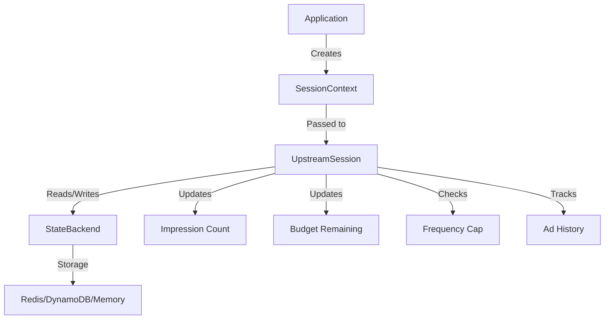
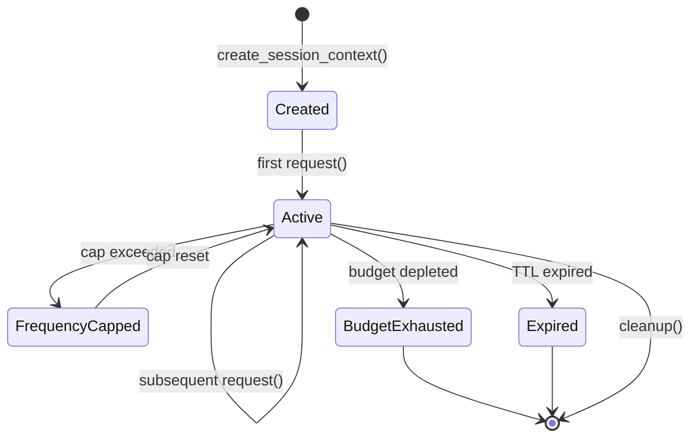

# Session Management Architecture

Session management in **xsp-lib** provides stateful ad serving capabilities including frequency capping, budget tracking, and user session persistence across multiple ad requests.

## Overview

The session management system is designed around three core concepts:

1. **SessionContext**: Immutable request context containing user and device information
2. **UpstreamSession**: Stateful protocol that maintains state across requests
3. **StateBackend**: Pluggable persistent storage for session data



## SessionContext: Immutable Request Context

**SessionContext** is an immutable data structure that carries user and request information throughout the ad serving flow.

### Design Principles

- **Immutable**: Once created, context cannot be modified
- **Serializable**: Can be JSON-serialized for logging and debugging
- **Type-safe**: Uses TypedDict for static type checking
- **Extensible**: Supports custom fields via extensions dict

### Definition

```python
from typing import TypedDict, Any, NotRequired

class SessionContext(TypedDict):
    """
    Immutable session context for ad requests.
    
    Contains user identification, device information, and request metadata
    that flows through the entire ad serving pipeline.
    """
    
    # Required fields
    session_id: str
    user_id: str
    timestamp: int  # Unix timestamp in milliseconds
    
    # Optional user identification
    device_id: NotRequired[str]
    ip_address: NotRequired[str]
    user_agent: NotRequired[str]
    
    # Optional device information
    device_type: NotRequired[str]  # "mobile", "tablet", "desktop", "ctv"
    os: NotRequired[str]  # "ios", "android", "windows", etc.
    os_version: NotRequired[str]
    
    # Optional geo information
    country: NotRequired[str]  # ISO 3166-1 alpha-2
    region: NotRequired[str]
    city: NotRequired[str]
    zip_code: NotRequired[str]
    lat: NotRequired[float]
    lon: NotRequired[float]
    
    # Optional privacy/consent
    gdpr: NotRequired[bool]
    gdpr_consent: NotRequired[str]
    ccpa: NotRequired[bool]
    coppa: NotRequired[bool]
    
    # Extension point for custom data
    extensions: NotRequired[dict[str, Any]]
```

### Usage Examples

**Basic Session Context**:

```python
from xsp.core.session import SessionContext
import time

# Create minimal session context
context: SessionContext = {
    "session_id": "sess_abc123",
    "user_id": "user_456",
    "timestamp": int(time.time() * 1000)
}
```

**Full Session Context**:

```python
context: SessionContext = {
    # Required
    "session_id": "sess_abc123",
    "user_id": "user_456",
    "timestamp": 1702234567890,
    
    # User identification
    "device_id": "device_789",
    "ip_address": "192.168.1.1",
    "user_agent": "Mozilla/5.0 ...",
    
    # Device information
    "device_type": "mobile",
    "os": "ios",
    "os_version": "17.1",
    
    # Geo information
    "country": "US",
    "region": "CA",
    "city": "San Francisco",
    "zip_code": "94102",
    
    # Privacy
    "gdpr": True,
    "gdpr_consent": "consent_string_here",
    
    # Extensions
    "extensions": {
        "advertiser_id": "adv_123",
        "campaign_id": "camp_456"
    }
}
```

**Context Creation Helper** (future):

```python
from xsp.core.session import create_session_context

context = create_session_context(
    user_id="user_456",
    device_id="device_789",
    ip_address="192.168.1.1",
    country="US"
)
```

### Immutability Benefits

1. **Thread-safe**: Can be safely shared across async tasks
2. **Cacheable**: Consistent hash for caching decisions
3. **Auditable**: Unchanged context for logging and debugging
4. **Functional**: Enables pure functions without side effects

## UpstreamSession: Stateful Protocol

**UpstreamSession** extends the basic `Upstream` protocol with session state management capabilities.

### Protocol Definition

```python
from typing import Protocol, TypeVar, Any
from xsp.core.session import SessionContext, SessionState

T = TypeVar("T", covariant=True)

class UpstreamSession(Protocol[T]):
    """
    Stateful upstream protocol with session management.
    
    Extends basic Upstream with session state tracking, frequency capping,
    and budget management capabilities.
    """
    
    async def request(
        self,
        *,
        session: SessionContext,
        params: dict[str, Any] | None = None,
        headers: dict[str, str] | None = None,
        **kwargs: Any,
    ) -> T:
        """
        Send request with session context.
        
        Automatically:
        - Checks frequency caps before request
        - Updates impression count after successful response
        - Decrements budget if applicable
        - Tracks ad history
        
        Args:
            session: Session context for this request
            params: Query parameters
            headers: HTTP headers
            **kwargs: Additional arguments
        
        Returns:
            Response of type T
        
        Raises:
            FrequencyCapExceeded: If user has seen too many ads
            BudgetExceeded: If campaign budget exhausted
            SessionError: If session state cannot be updated
        """
        ...
    
    async def get_state(self, session: SessionContext) -> SessionState:
        """Get current session state for user."""
        ...
    
    async def update_state(
        self,
        session: SessionContext,
        updates: dict[str, Any]
    ) -> None:
        """Update session state fields."""
        ...
    
    async def close(self) -> None:
        """Close upstream and state backend."""
        ...
```

### SessionState Structure

```python
from typing import TypedDict, NotRequired, Any

class SessionState(TypedDict):
    """
    Mutable session state stored in backend.
    
    Tracks user's ad viewing history, budgets, and frequency caps.
    """
    
    # Impression tracking
    impression_count: int  # Total impressions shown
    last_impression_timestamp: NotRequired[int]  # Unix timestamp in ms
    
    # Frequency capping
    hourly_impression_count: int
    daily_impression_count: int
    weekly_impression_count: int
    
    # Ad history
    ad_history: NotRequired[list[str]]  # List of ad IDs shown
    
    # Budget tracking
    budget_spent: NotRequired[float]  # Amount spent in dollars
    budget_remaining: NotRequired[float]  # Amount remaining
    
    # Custom state
    extensions: NotRequired[dict[str, Any]]
```

### Implementation Example

```python
from xsp.core.base import BaseUpstream
from xsp.core.session import SessionContext, SessionState, UpstreamSession
from xsp.core.state import StateBackend

class SessionAwareUpstream(BaseUpstream[T], UpstreamSession[T]):
    """Base upstream with session management."""
    
    def __init__(
        self,
        state_backend: StateBackend,
        *,
        frequency_cap_hourly: int | None = None,
        frequency_cap_daily: int | None = None,
        frequency_cap_weekly: int | None = None,
        **kwargs
    ):
        super().__init__(**kwargs)
        self.state_backend = state_backend
        self.frequency_cap_hourly = frequency_cap_hourly
        self.frequency_cap_daily = frequency_cap_daily
        self.frequency_cap_weekly = frequency_cap_weekly
    
    async def request(
        self,
        *,
        session: SessionContext,
        params: dict[str, Any] | None = None,
        **kwargs: Any,
    ) -> T:
        """Request with session tracking."""
        # Get current state
        state = await self.get_state(session)
        
        # Check frequency caps
        await self._check_frequency_caps(state)
        
        # Make request
        response = await self.fetch(params=params, **kwargs)
        
        # Update state after successful request
        await self._update_after_request(session, response)
        
        return response
    
    async def _check_frequency_caps(self, state: SessionState) -> None:
        """Check if frequency caps are exceeded."""
        if self.frequency_cap_hourly is not None:
            if state["hourly_impression_count"] >= self.frequency_cap_hourly:
                raise FrequencyCapExceeded("Hourly frequency cap exceeded")
        
        if self.frequency_cap_daily is not None:
            if state["daily_impression_count"] >= self.frequency_cap_daily:
                raise FrequencyCapExceeded("Daily frequency cap exceeded")
        
        if self.frequency_cap_weekly is not None:
            if state["weekly_impression_count"] >= self.frequency_cap_weekly:
                raise FrequencyCapExceeded("Weekly frequency cap exceeded")
    
    async def _update_after_request(
        self,
        session: SessionContext,
        response: T
    ) -> None:
        """Update session state after successful request."""
        updates = {
            "impression_count": 1,  # Increment
            "last_impression_timestamp": session["timestamp"],
            "hourly_impression_count": 1,
            "daily_impression_count": 1,
            "weekly_impression_count": 1,
        }
        
        await self.update_state(session, updates)
    
    async def get_state(self, session: SessionContext) -> SessionState:
        """Get session state from backend."""
        key = f"session:{session['user_id']}"
        state_dict = await self.state_backend.get(key)
        
        if state_dict is None:
            # Initialize new session
            return {
                "impression_count": 0,
                "hourly_impression_count": 0,
                "daily_impression_count": 0,
                "weekly_impression_count": 0,
            }
        
        return state_dict
    
    async def update_state(
        self,
        session: SessionContext,
        updates: dict[str, Any]
    ) -> None:
        """Update session state in backend."""
        key = f"session:{session['user_id']}"
        
        # Increment counters atomically
        for field, value in updates.items():
            if isinstance(value, int):
                await self.state_backend.increment(key, field, value)
            else:
                # Set value directly
                current_state = await self.state_backend.get(key) or {}
                current_state[field] = value
                await self.state_backend.set(key, current_state)
```

## Session Lifecycle

The session lifecycle tracks state from creation through multiple requests to cleanup:



### Lifecycle Stages

**1. Creation**:

```python
# Create session context
context = SessionContext(
    session_id="sess_123",
    user_id="user_456",
    timestamp=int(time.time() * 1000)
)

# Session state does not exist yet in backend
```

**2. First Request**:

```python
# First request initializes state
upstream = SessionAwareUpstream(
    state_backend=redis_backend,
    frequency_cap_daily=10
)

response = await upstream.request(
    session=context,
    params={"w": "640", "h": "480"}
)

# State now exists in backend:
# {
#     "impression_count": 1,
#     "hourly_impression_count": 1,
#     "daily_impression_count": 1,
#     "weekly_impression_count": 1,
#     "last_impression_timestamp": 1702234567890
# }
```

**3. Subsequent Requests**:

```python
# Later requests update existing state
response2 = await upstream.request(session=context, params={...})

# State updated:
# {
#     "impression_count": 2,
#     "hourly_impression_count": 2,
#     "daily_impression_count": 2,
#     "weekly_impression_count": 2,
#     "last_impression_timestamp": 1702234578901
# }
```

**4. Frequency Cap Hit**:

```python
# After 10 requests in same day
try:
    response11 = await upstream.request(session=context, params={...})
except FrequencyCapExceeded as e:
    # User has hit daily frequency cap
    print(f"Cap exceeded: {e}")
```

**5. Cap Reset**:

```python
# Background job resets daily counters at midnight
await state_backend.set(
    f"session:{context['user_id']}",
    {"daily_impression_count": 0}
)

# User can now see ads again
response = await upstream.request(session=context, params={...})
```

**6. Cleanup**:

```python
# Close upstream and backend connections
await upstream.close()
```

## State Backend Architecture

State backends provide persistent storage for session state with atomic operations.

### Backend Protocol

```python
from typing import Protocol, Any

class StateBackend(Protocol):
    """
    State storage backend with atomic operations.
    
    Implementations must provide:
    - Atomic increment operations for counters
    - TTL support for automatic expiration
    - Optional: Multi-get for batch operations
    """
    
    async def get(self, key: str) -> dict[str, Any] | None:
        """
        Get state by key.
        
        Args:
            key: State key
        
        Returns:
            State dictionary or None if not found
        """
        ...
    
    async def set(
        self,
        key: str,
        value: dict[str, Any],
        ttl: int | None = None
    ) -> None:
        """
        Set state by key.
        
        Args:
            key: State key
            value: State dictionary
            ttl: Optional time-to-live in seconds
        """
        ...
    
    async def increment(
        self,
        key: str,
        field: str,
        amount: int = 1
    ) -> int:
        """
        Atomically increment a field.
        
        Args:
            key: State key
            field: Field to increment
            amount: Amount to increment by
        
        Returns:
            New value after increment
        """
        ...
    
    async def delete(self, key: str) -> None:
        """Delete state by key."""
        ...
    
    async def close(self) -> None:
        """Close backend connection."""
        ...
```

### Redis Backend Implementation

```python
import json
from typing import Any
import redis.asyncio as redis

class RedisStateBackend:
    """Redis-based state backend."""
    
    def __init__(
        self,
        redis_url: str = "redis://localhost:6379",
        default_ttl: int = 86400  # 24 hours
    ):
        self.redis_url = redis_url
        self.default_ttl = default_ttl
        self._client: redis.Redis | None = None
    
    async def _get_client(self) -> redis.Redis:
        """Lazy initialize Redis client."""
        if self._client is None:
            self._client = await redis.from_url(self.redis_url)
        return self._client
    
    async def get(self, key: str) -> dict[str, Any] | None:
        """Get state from Redis."""
        client = await self._get_client()
        data = await client.get(key)
        
        if data is None:
            return None
        
        return json.loads(data)
    
    async def set(
        self,
        key: str,
        value: dict[str, Any],
        ttl: int | None = None
    ) -> None:
        """Set state in Redis with optional TTL."""
        client = await self._get_client()
        data = json.dumps(value)
        
        if ttl is not None:
            await client.setex(key, ttl, data)
        elif self.default_ttl is not None:
            await client.setex(key, self.default_ttl, data)
        else:
            await client.set(key, data)
    
    async def increment(
        self,
        key: str,
        field: str,
        amount: int = 1
    ) -> int:
        """Atomically increment field using Redis hash."""
        client = await self._get_client()
        
        # Use HINCRBY for atomic increment
        new_value = await client.hincrby(key, field, amount)
        
        # Set TTL if not already set
        if self.default_ttl is not None:
            ttl = await client.ttl(key)
            if ttl == -1:  # No expiration set
                await client.expire(key, self.default_ttl)
        
        return new_value
    
    async def delete(self, key: str) -> None:
        """Delete state from Redis."""
        client = await self._get_client()
        await client.delete(key)
    
    async def close(self) -> None:
        """Close Redis connection."""
        if self._client is not None:
            await self._client.close()
```

### Memory Backend Implementation

```python
import asyncio
from typing import Any

class MemoryStateBackend:
    """In-memory state backend for testing."""
    
    def __init__(self):
        self._store: dict[str, dict[str, Any]] = {}
        self._lock = asyncio.Lock()
    
    async def get(self, key: str) -> dict[str, Any] | None:
        """Get state from memory."""
        async with self._lock:
            return self._store.get(key)
    
    async def set(
        self,
        key: str,
        value: dict[str, Any],
        ttl: int | None = None
    ) -> None:
        """Set state in memory (TTL ignored)."""
        async with self._lock:
            self._store[key] = value.copy()
    
    async def increment(
        self,
        key: str,
        field: str,
        amount: int = 1
    ) -> int:
        """Atomically increment field."""
        async with self._lock:
            if key not in self._store:
                self._store[key] = {}
            
            current = self._store[key].get(field, 0)
            new_value = current + amount
            self._store[key][field] = new_value
            
            return new_value
    
    async def delete(self, key: str) -> None:
        """Delete state from memory."""
        async with self._lock:
            self._store.pop(key, None)
    
    async def close(self) -> None:
        """No-op for memory backend."""
        pass
```

## Frequency Capping Implementation

Frequency capping limits how many ads a user sees in a time window.

### Counter Reset Strategy

```python
import time
from typing import Literal

FrequencyWindow = Literal["hour", "day", "week"]

class FrequencyCapManager:
    """Manage frequency cap counters with automatic reset."""
    
    def __init__(self, state_backend: StateBackend):
        self.state_backend = state_backend
    
    async def should_reset_counter(
        self,
        session: SessionContext,
        window: FrequencyWindow
    ) -> bool:
        """Check if counter should be reset based on time window."""
        state = await self.state_backend.get(
            f"session:{session['user_id']}"
        )
        
        if state is None:
            return False
        
        last_ts = state.get("last_impression_timestamp")
        if last_ts is None:
            return False
        
        current_ts = session["timestamp"]
        delta_ms = current_ts - last_ts
        
        if window == "hour":
            return delta_ms >= 3600_000  # 1 hour in ms
        elif window == "day":
            return delta_ms >= 86400_000  # 24 hours in ms
        elif window == "week":
            return delta_ms >= 604800_000  # 7 days in ms
        
        return False
    
    async def reset_counters_if_needed(
        self,
        session: SessionContext
    ) -> None:
        """Reset counters that have expired."""
        updates = {}
        
        if await self.should_reset_counter(session, "hour"):
            updates["hourly_impression_count"] = 0
        
        if await self.should_reset_counter(session, "day"):
            updates["daily_impression_count"] = 0
        
        if await self.should_reset_counter(session, "week"):
            updates["weekly_impression_count"] = 0
        
        if updates:
            key = f"session:{session['user_id']}"
            current_state = await self.state_backend.get(key) or {}
            current_state.update(updates)
            await self.state_backend.set(key, current_state)
```

## Budget Tracking Integration

Track campaign budget spending across ad requests.

```python
class BudgetTracker:
    """Track and enforce campaign budgets."""
    
    def __init__(
        self,
        state_backend: StateBackend,
        campaign_id: str,
        total_budget: float
    ):
        self.state_backend = state_backend
        self.campaign_id = campaign_id
        self.total_budget = total_budget
    
    async def get_remaining_budget(self) -> float:
        """Get remaining budget for campaign."""
        key = f"campaign:{self.campaign_id}:budget"
        state = await self.state_backend.get(key)
        
        if state is None:
            return self.total_budget
        
        spent = state.get("budget_spent", 0.0)
        return max(0.0, self.total_budget - spent)
    
    async def charge(self, amount: float) -> None:
        """
        Charge amount to campaign budget.
        
        Raises:
            BudgetExceeded: If insufficient budget
        """
        remaining = await self.get_remaining_budget()
        
        if amount > remaining:
            raise BudgetExceeded(
                f"Insufficient budget: {remaining} < {amount}"
            )
        
        # Atomically increment spent amount
        key = f"campaign:{self.campaign_id}:budget"
        current_state = await self.state_backend.get(key) or {}
        current_state["budget_spent"] = current_state.get("budget_spent", 0.0) + amount
        await self.state_backend.set(key, current_state)
```

## Multi-Ad Pod Session Handling (VMAP)

VMAP (Video Multiple Ad Playlist) requires tracking state across multiple ads in a pod.

```python
from typing import TypedDict, NotRequired

class AdPodContext(TypedDict):
    """Context for ad pod (multiple ads in sequence)."""
    
    session: SessionContext
    pod_id: str
    total_ads: int
    current_ad_index: int
    ads_shown: list[str]  # Ad IDs shown so far
    
class VmapSessionUpstream(SessionAwareUpstream[str]):
    """VAST/VMAP upstream with ad pod session management."""
    
    async def request_ad_pod(
        self,
        session: SessionContext,
        num_ads: int,
        **kwargs
    ) -> list[str]:
        """
        Request multiple ads for an ad pod.
        
        Ensures:
        - Frequency caps apply across entire pod
        - No duplicate ads in same pod
        - Pod tracked as single session
        """
        pod_id = f"pod_{session['session_id']}_{int(time.time())}"
        
        pod_context: AdPodContext = {
            "session": session,
            "pod_id": pod_id,
            "total_ads": num_ads,
            "current_ad_index": 0,
            "ads_shown": []
        }
        
        ads: list[str] = []
        
        for i in range(num_ads):
            pod_context["current_ad_index"] = i
            
            # Request individual ad
            ad = await self.request(
                session=session,
                params={"pod_context": pod_context},
                **kwargs
            )
            
            # Track ad in pod context
            pod_context["ads_shown"].append(self._extract_ad_id(ad))
            ads.append(ad)
        
        # Update session state for entire pod
        await self._update_pod_state(session, pod_context)
        
        return ads
    
    async def _update_pod_state(
        self,
        session: SessionContext,
        pod_context: AdPodContext
    ) -> None:
        """Update session state after pod completion."""
        # Count pod as single impression for frequency cap
        await self.update_state(
            session,
            {
                "impression_count": 1,
                "hourly_impression_count": 1,
                "daily_impression_count": 1,
                "weekly_impression_count": 1,
                "ad_history": pod_context["ads_shown"]
            }
        )
```

## Best Practices

### 1. Session Context Immutability

**❌ DON'T mutate session context:**

```python
# BAD: Mutating context
context["timestamp"] = new_timestamp
```

**✅ DO create new context:**

```python
# GOOD: Create new context
new_context = {**context, "timestamp": new_timestamp}
```

### 2. State Key Naming

Use consistent, hierarchical key naming:

```python
# User session state
f"session:{user_id}"

# Campaign budget state
f"campaign:{campaign_id}:budget"

# Ad pod state
f"pod:{pod_id}:context"
```

### 3. Atomic Operations

Always use atomic operations for counters:

```python
# ✅ GOOD: Atomic increment
await state_backend.increment(key, "impression_count", 1)

# ❌ BAD: Read-modify-write race condition
state = await state_backend.get(key)
state["impression_count"] += 1
await state_backend.set(key, state)
```

### 4. TTL Management

Set appropriate TTL for session data:

```python
# Short TTL for transient data
await state_backend.set(
    f"session:{user_id}:temp",
    data,
    ttl=3600  # 1 hour
)

# Long TTL for user history
await state_backend.set(
    f"session:{user_id}:history",
    data,
    ttl=2592000  # 30 days
)
```

### 5. Error Handling

Handle state backend failures gracefully:

```python
try:
    state = await state_backend.get(key)
except StateBackendError as e:
    # Log error and use default state
    logger.error(f"State backend error: {e}")
    state = default_session_state()
```

## Related Documentation

- [Final Architecture](./architecture-final.md)
- [Terminology Reference](./architecture-terminology.md)
- [Protocol-Agnostic Design](./architecture-protocol-agnostic-design.md)
