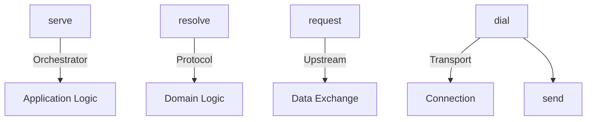
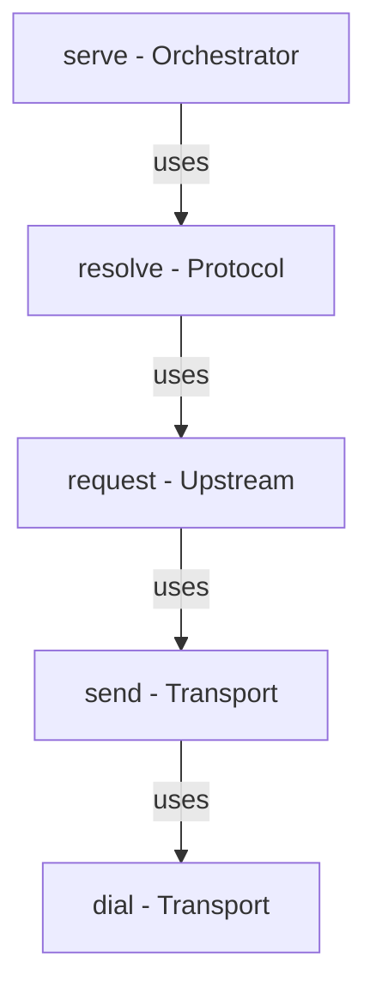

# Terminology Reference

This document defines the precise terminology used throughout **xsp-lib** to ensure clear communication and consistent implementation across the codebase.

## Overview

The library uses specific terms for operations at each architectural layer. Understanding this terminology is essential for working with the codebase and contributing to the project.



## Core Terms by Layer

### Transport Layer Terms

| Term | Meaning | Usage | Example |
|------|---------|-------|---------|
| **dial()** | Establish connection or client | Creating HTTP client, gRPC channel, opening file | `transport = HttpTransport()` |
| **send()** | Transmit bytes over connection | Low-level data transmission | `await transport.send(endpoint, payload, metadata)` |
| **close()** | Release connection resources | Cleanup connection pool, close files | `await transport.close()` |

### Upstream Layer Terms

| Term | Meaning | Usage | Example |
|------|---------|-------|---------|
| **request()** | Send structured data, receive response | Preferred term for data exchange | `result = await upstream.fetch(params=...)` |
| **fetch()** | Legacy name for request() | **DEPRECATED** - use request() in new code | `result = await upstream.fetch()` |
| **decode()** | Convert bytes to typed response | Response deserialization | `decoder=lambda b: json.loads(b)` |
| **encode()** | Convert payload to bytes | Request serialization | `encoder=lambda obj: json.dumps(obj).encode()` |

### Protocol Layer Terms

| Term | Meaning | Usage | Example |
|------|---------|-------|---------|
| **resolve()** | Follow wrapper chains, handle redirects | VAST wrapper resolution, OpenRTB redirect following | `resolved = await vast.resolve_wrappers(xml)` |
| **parse()** | Extract structured data from response | XML/JSON parsing | `ad_data = parse_vast_xml(xml)` |
| **substitute()** | Replace macros with values | IAB macro substitution | `url = substitute_macros(template, context)` |

### Orchestrator Layer Terms

| Term | Meaning | Usage | Example |
|------|---------|-------|---------|
| **serve()** | High-level ad serving with full orchestration | Route, cache, session management | `response = await orchestrator.serve(request, session)` |
| **route()** | Select upstream based on criteria | Choose VAST vs OpenRTB based on format | `upstream = router.route(request)` |

## Detailed Term Definitions

### dial()

**Layer**: Transport  
**Type**: Connection establishment  
**Deprecated**: No  
**Status**: Active

**Definition**: Establish a connection or create a client instance that can be used for subsequent data transmission.

**Etymology**: Borrowed from network programming (e.g., Go's `net.Dial`), referring to "dialing" a connection like a telephone.

**When to Use**:
- Initializing HTTP client with connection pool
- Creating gRPC channel
- Opening file handle
- Establishing WebSocket connection

**When NOT to Use**:
- Sending actual data (use `send()` instead)
- Application-level requests (use `request()` instead)

**Code Examples**:

```python
# HTTP Transport - dial creates connection pool
from xsp.transports.http import HttpTransport

transport = HttpTransport()  # dial: create HTTP client with connection pool
# Connection pool is now ready for use
```

```python
# File Transport - dial opens file handle
from xsp.transports.file import FileTransport

transport = FileTransport()  # dial: prepare file system access
```

```python
# Future: gRPC Transport
from xsp.transports.grpc import GrpcTransport

transport = GrpcTransport(
    host="grpc.example.com",
    port=50051
)  # dial: establish gRPC channel
```

### send()

**Layer**: Transport  
**Type**: Data transmission  
**Deprecated**: No  
**Status**: Active

**Definition**: Transmit bytes over an established connection and return response bytes.

**When to Use**:
- Sending HTTP request
- Transmitting gRPC message
- Writing to/reading from file
- Sending WebSocket frame

**When NOT to Use**:
- High-level application requests (use `request()` at Upstream layer)

**Code Examples**:

```python
# HTTP send
transport = HttpTransport()
response_bytes = await transport.send(
    endpoint="https://api.example.com/data",
    payload=None,  # GET request
    metadata={"User-Agent": "xsp-lib/1.0"},
    timeout=10.0
)
```

```python
# File send (read from file)
transport = FileTransport()
file_bytes = await transport.send(
    endpoint="/path/to/data.xml",
    payload=None,
    metadata=None
)
```

```python
# Future: gRPC send
transport = GrpcTransport(...)
response_bytes = await transport.send(
    endpoint="/service.Method",
    payload=protobuf_bytes,
    metadata={"authorization": "Bearer token"}
)
```

### request()

**Layer**: Upstream  
**Type**: Structured data exchange  
**Deprecated**: No (preferred over `fetch()`)  
**Status**: Active

**Definition**: Send structured request with parameters/headers and receive typed response after decoding.

**Terminology Note**: In current code, this operation is implemented as `fetch()`, but should conceptually be understood as `request()`. Future versions may rename the method.

**When to Use**:
- Making API calls with parameters
- Fetching data from upstream services
- Any structured data exchange

**When NOT to Use**:
- Low-level byte transmission (use `send()` at Transport layer)
- Protocol-specific operations like wrapper resolution (use `resolve()` at Protocol layer)

**Code Examples**:

```python
# JSON API request
import json
from xsp.core.base import BaseUpstream
from xsp.transports.http import HttpTransport

upstream = BaseUpstream(
    transport=HttpTransport(),
    decoder=lambda b: json.loads(b.decode('utf-8')),
    endpoint="https://api.example.com/data"
)

# request: structured exchange
result = await upstream.fetch(params={"id": "123", "format": "json"})
# result is typed as dict (from decoder)
```

```python
# VAST XML request
from xsp.protocols.vast import VastUpstream

upstream = VastUpstream(
    transport=HttpTransport(),
    endpoint="https://ad-server.example.com/vast"
)

# request: get VAST XML
vast_xml = await upstream.fetch(
    params={"w": "640", "h": "480", "userId": "user123"}
)
# vast_xml is typed as str
```

```python
# Custom decoder request
from dataclasses import dataclass

@dataclass
class ApiResponse:
    status: str
    data: dict

def decode_api_response(b: bytes) -> ApiResponse:
    data = json.loads(b.decode('utf-8'))
    return ApiResponse(status=data["status"], data=data["data"])

upstream = BaseUpstream(
    transport=HttpTransport(),
    decoder=decode_api_response,
    endpoint="https://api.example.com"
)

response: ApiResponse = await upstream.fetch()
```

### fetch()

**Layer**: Upstream  
**Type**: Structured data exchange  
**Deprecated**: **YES** (use `request()` conceptually)  
**Status**: Active for backward compatibility

**Definition**: Legacy name for `request()` operation. Maintained for backward compatibility but conceptually replaced by `request()`.

**Migration Path**:

Current code uses `fetch()` as the method name:

```python
# Current implementation
result = await upstream.fetch(params=...)
```

Conceptually, think of this as `request()`:

```python
# Conceptual understanding
result = await upstream.request(params=...)
```

Future versions may provide both methods:

```python
# Future: explicit request() method
result = await upstream.request(params=...)

# fetch() as deprecated alias
result = await upstream.fetch(params=...)  # calls request() internally
```

### resolve()

**Layer**: Protocol  
**Type**: Domain-specific processing  
**Deprecated**: No  
**Status**: Active

**Definition**: Process protocol-specific semantics such as following wrapper chains, resolving redirects, or chasing bid responses.

**When to Use**:
- VAST wrapper resolution (following VASTAdTagURI)
- OpenRTB redirect handling
- Multi-step protocol flows
- Recursive ad fetching

**When NOT to Use**:
- Simple parsing (use `parse()` instead)
- Single requests (use `request()` instead)

**Code Examples**:

```python
# VAST wrapper resolution
from xsp.protocols.vast import VastUpstream

upstream = VastUpstream(
    transport=HttpTransport(),
    endpoint="https://ad-server.example.com/vast",
    max_wrapper_depth=5
)

# Step 1: request - get VAST (may be wrapper)
vast_xml = await upstream.fetch(params={"w": "640", "h": "480"})

# Step 2: resolve - follow wrapper chain to inline ad
resolved_xml = await upstream.resolve_wrappers(vast_xml)
# resolved_xml is guaranteed to be inline ad (or error)
```

```python
# OpenRTB redirect resolution (future)
from xsp.protocols.openrtb import OpenRtbUpstream

upstream = OpenRtbUpstream(...)

# request: initial bid request
bid_response = await upstream.fetch(bid_request)

# resolve: follow nurl redirect if present
if bid_response.nurl:
    final_response = await upstream.resolve_redirect(bid_response)
```

```python
# Custom resolve operation
class CustomProtocolUpstream(BaseUpstream[dict]):
    async def resolve_chain(self, initial_response: dict) -> dict:
        """Resolve multi-step response chain."""
        current = initial_response
        depth = 0
        
        while "next_url" in current and depth < 10:
            # Follow chain
            next_response = await self.fetch(
                endpoint=current["next_url"]
            )
            current = next_response
            depth += 1
        
        return current
```

### serve()

**Layer**: Orchestrator  
**Type**: Application orchestration  
**Deprecated**: No  
**Status**: Future (not yet implemented)

**Definition**: High-level ad serving operation that coordinates multiple upstreams, applies routing, caching, session management, and business logic.

**When to Use**:
- Complete ad serving flow
- Multi-upstream coordination
- Session-aware ad delivery
- Cached ad serving

**When NOT to Use**:
- Direct upstream access (use `request()` at Upstream layer)
- Protocol-specific operations (use `resolve()` at Protocol layer)

**Code Examples** (Future):

```python
# Complete ad serving with orchestration
from xsp.orchestrator import AdOrchestrator

orchestrator = AdOrchestrator(
    upstreams={
        "vast": vast_upstream,
        "openrtb": openrtb_upstream
    },
    cache=RedisCache(),
    router=AdRouter()
)

# serve: full orchestration
response = await orchestrator.serve(
    request=AdRequest(
        user_id="user123",
        width=640,
        height=480,
        format="vast"
    ),
    session=SessionContext(
        session_id="sess_456",
        user_id="user123",
        timestamp=1702234567890
    )
)

# Orchestrator handled:
# 1. Route to vast_upstream based on format
# 2. Check cache for existing response
# 3. Check session frequency caps
# 4. Request from upstream if needed
# 5. Resolve wrappers
# 6. Update session state
# 7. Cache response
# 8. Return AdResponse
```

## Term Comparison Matrix

### Layer-by-Layer Comparison

| Layer | Connection | Data Transfer | Processing | High-Level |
|-------|-----------|---------------|------------|------------|
| **Transport** | `dial()` | `send()` | - | - |
| **Upstream** | - | `request()`/`fetch()` | `decode()`/`encode()` | - |
| **Protocol** | - | - | `resolve()`, `parse()` | - |
| **Orchestrator** | - | - | - | `serve()` |

### Operation Hierarchy



### Abstraction Levels

```
High Abstraction (Application)
    ↑
    serve() - Complete ad serving with business logic
    ↑
    resolve() - Protocol-specific multi-step flows
    ↑
    request() - Structured data exchange with typing
    ↑
    send() - Byte transmission
    ↑
    dial() - Connection establishment
    ↓
Low Abstraction (I/O)
```

## Common Patterns

### Pattern 1: Simple Request

```python
# Transport: dial
transport = HttpTransport()

# Upstream: request
upstream = BaseUpstream(transport=transport, decoder=...)
result = await upstream.fetch(params=...)

# Transport: close
await transport.close()
```

**Terms Used**: `dial()` (implicit), `request()`/`fetch()`, `close()`

### Pattern 2: Protocol Resolution

```python
# Transport: dial
transport = HttpTransport()

# Upstream: request (initial)
upstream = VastUpstream(transport=transport, endpoint=...)
vast_xml = await upstream.fetch(params=...)

# Protocol: resolve
resolved_xml = await upstream.resolve_wrappers(vast_xml)

# Transport: close
await transport.close()
```

**Terms Used**: `dial()` (implicit), `request()`/`fetch()`, `resolve()`, `close()`

### Pattern 3: Orchestrated Serving (Future)

```python
# Orchestrator: serve (handles all lower layers)
orchestrator = AdOrchestrator(upstreams=..., cache=..., router=...)
response = await orchestrator.serve(request, session)

# Orchestrator internally:
# - route() to select upstream
# - request() from upstream
# - resolve() wrapper chains
# - Update session state
# - Cache response
```

**Terms Used**: `serve()` (encompasses `route()`, `request()`, `resolve()`)

## Deprecated Terms

### fetch()

**Status**: Deprecated for conceptual understanding (but still used in implementation)  
**Replacement**: `request()`  
**Migration Timeline**: 
- Current: `fetch()` is the implemented method name
- Future: Both `fetch()` and `request()` available
- Long-term: `fetch()` may become deprecated alias

**Why Deprecated**:
- Generic name doesn't convey "request/response" semantics
- Conflicts with browser `fetch()` API conceptually
- `request()` better matches HTTP and RPC terminology

**Migration Guide**:

When thinking about the operation:

```python
# ❌ Think: "fetching data"
# ✅ Think: "requesting from upstream"

# Current code (still correct):
result = await upstream.fetch(params=...)

# Conceptual understanding:
# "sending request to upstream and receiving response"
```

When naming custom methods:

```python
# ❌ Don't use fetch for new methods
async def fetch_ads(self): ...

# ✅ Use request for new methods
async def request_ads(self): ...
```

## Anti-Patterns

### ❌ Wrong Layer Usage

```python
# BAD: Using transport send() for application logic
transport = HttpTransport()
response = await transport.send(
    endpoint="https://api.example.com?id=123&format=json",
    metadata={"User-Agent": "app"}
)
data = json.loads(response)  # Manual decoding

# GOOD: Use upstream request() for application logic
upstream = BaseUpstream(
    transport=HttpTransport(),
    decoder=lambda b: json.loads(b.decode('utf-8')),
    endpoint="https://api.example.com"
)
data = await upstream.fetch(params={"id": "123", "format": "json"})
```

### ❌ Terminology Confusion

```python
# BAD: Calling high-level operation "dial"
async def dial_ad_server(self):  # Confusing name
    return await self.upstream.fetch()

# GOOD: Use appropriate term for level
async def request_ad(self):  # Clear intent
    return await self.upstream.fetch()
```

### ❌ Mixed Abstractions

```python
# BAD: Mixing transport and upstream concepts
class MyUpstream(BaseUpstream):
    async def send_request(self, params):  # "send" is transport term
        return await self.fetch(params=params)

# GOOD: Use upstream terminology
class MyUpstream(BaseUpstream):
    async def request_data(self, params):  # "request" is upstream term
        return await self.fetch(params=params)
```

## Glossary

### A-Z Term Reference

| Term | Layer | Definition |
|------|-------|------------|
| **close()** | Transport/Upstream | Release resources and cleanup |
| **decode()** | Upstream | Convert bytes to typed response |
| **dial()** | Transport | Establish connection |
| **encode()** | Upstream | Convert payload to bytes |
| **fetch()** | Upstream | **DEPRECATED** - legacy name for request() |
| **parse()** | Protocol | Extract structured data from response |
| **request()** | Upstream | Send structured data, receive typed response |
| **resolve()** | Protocol | Follow wrapper chains, handle redirects |
| **route()** | Orchestrator | Select upstream based on criteria |
| **send()** | Transport | Transmit bytes over connection |
| **serve()** | Orchestrator | High-level ad serving with orchestration |
| **substitute()** | Protocol | Replace macros with values |

## Related Documentation

- [Final Architecture](./architecture-final.md) - Complete architecture overview
- [Session Management Architecture](./architecture-session-management.md) - Session management details
- [Protocol-Agnostic Design](./architecture-protocol-agnostic-design.md) - Generic request/response schemas

## Contributing

When contributing to xsp-lib, please use this terminology consistently:

1. Use `dial()` for connection establishment in Transport layer
2. Use `request()` conceptually for Upstream layer (even though code uses `fetch()`)
3. Use `resolve()` for Protocol layer multi-step operations
4. Use `serve()` for future Orchestrator layer
5. Avoid using deprecated terms in new documentation
6. When in doubt, refer to this document
