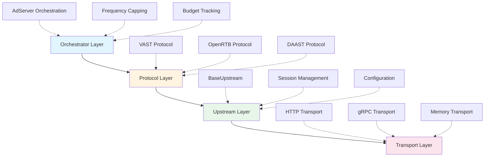
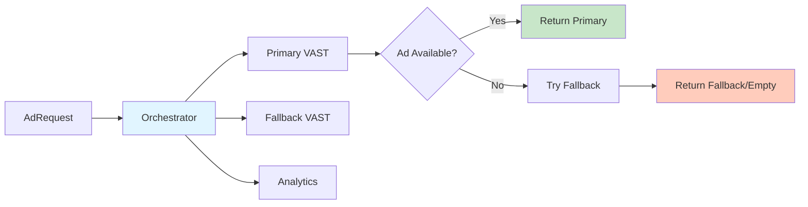
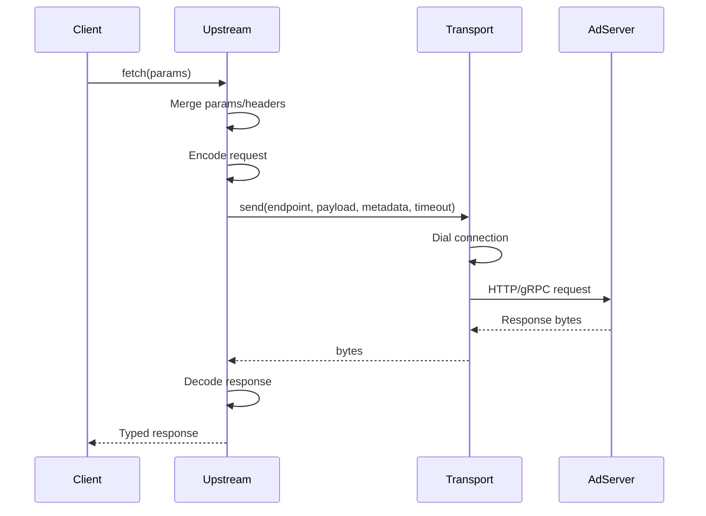
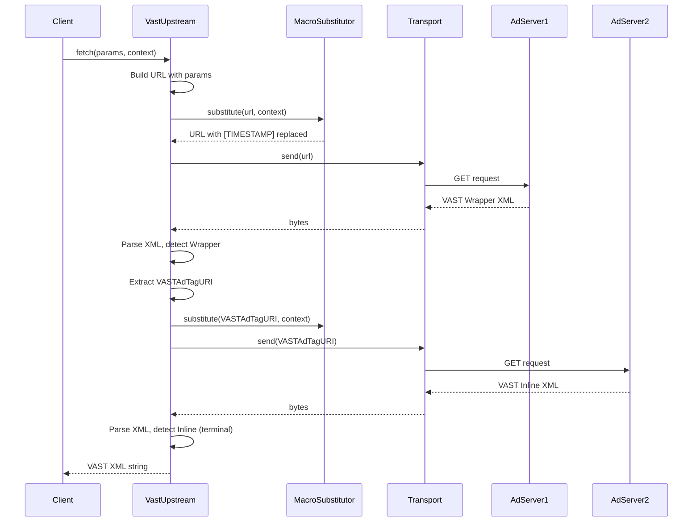
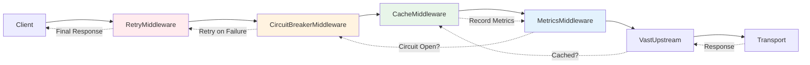
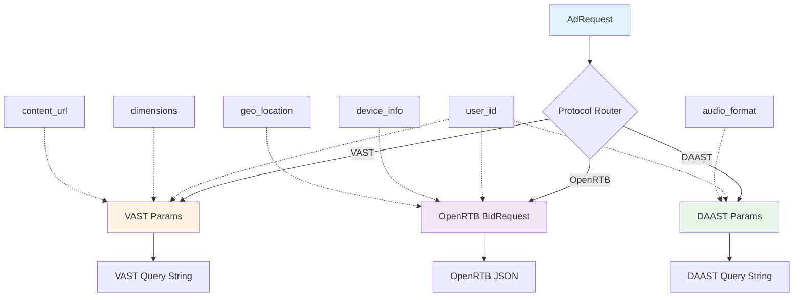
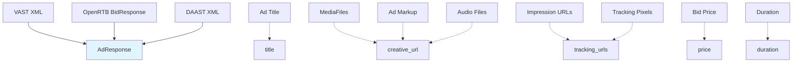
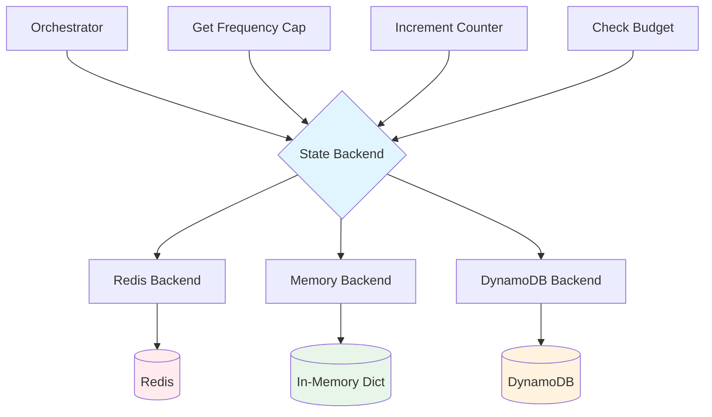

# Final Architecture Documentation

This document provides a comprehensive overview of the xsp-lib architecture, detailing the layered system design, component interactions, and data flow patterns for AdTech protocol implementations.

## Table of Contents

1. [System Overview](#system-overview)
2. [Architectural Layers](#architectural-layers)
3. [Component Interaction](#component-interaction)
4. [Data Flow Patterns](#data-flow-patterns)
5. [Protocol Integration](#protocol-integration)
6. [Session Management](#session-management)
7. [State Backend Architecture](#state-backend-architecture)
8. [Extension Points](#extension-points)

## System Overview

**xsp-lib** is a protocol-agnostic AdTech service library designed around a layered architecture that separates concerns and enables flexible composition of components. The architecture follows these core principles:

- **Separation of Concerns**: Each layer has a distinct responsibility
- **Protocol Agnostic**: Generic abstractions support any AdTech protocol
- **Composability**: Components can be combined in flexible ways
- **Type Safety**: Full type hints with strict mypy compliance
- **Testability**: Pluggable components enable comprehensive testing

### Architectural Goals

1. **Unified Interface**: Single API for VAST, OpenRTB, DAAST, and custom protocols
2. **Transport Independence**: Support HTTP, gRPC, WebSocket, file, and memory transports
3. **Extensibility**: Enable custom protocols without modifying core library
4. **Production Ready**: Built-in retry logic, timeouts, circuit breakers, and observability
5. **IAB Compliance**: Adherence to IAB Tech Lab specifications

## Architectural Layers

The xsp-lib architecture consists of four primary layers, each with distinct responsibilities:



### Layer 1: Transport Layer

**Responsibility**: Low-level I/O operations and connection management

The Transport layer abstracts network communication through the `Transport` protocol:

```python
class Transport(Protocol):
    """Transport layer protocol."""
    
    @property
    def transport_type(self) -> TransportType:
        """Return the transport type."""
        ...
    
    async def send(
        self,
        endpoint: str,
        payload: bytes | None = None,
        metadata: dict[str, str] | None = None,
        timeout: float | None = None,
    ) -> bytes:
        """Send a request and return the response."""
        ...
    
    async def close(self) -> None:
        """Close the transport and release resources."""
        ...
```

**Key Responsibilities**:
- **Connection Management**: Establish and maintain network connections
- **Data Transmission**: Send/receive raw bytes over network
- **Error Handling**: Handle network-level errors (DNS, connection refused, etc.)
- **Resource Cleanup**: Properly close connections and release resources

**Implementations**:
- `HttpTransport`: REST APIs and XML feeds (VAST, OpenDirect)
- `GrpcTransport`: Binary protocols (future)
- `WebSocketTransport`: Real-time streaming (future)
- `FileTransport`: Local file access for testing
- `MemoryTransport`: In-memory mock for unit tests

**Terminology**: The Transport layer **dials** a connection to establish communication with remote services.

### Layer 2: Upstream Layer

**Responsibility**: Request/response handling and data transformation

The Upstream layer builds on Transport by adding serialization, configuration, and request composition:

```python
class Upstream(Protocol[T]):
    """Universal upstream service protocol."""
    
    async def fetch(
        self,
        *,
        params: dict[str, Any] | None = None,
        headers: dict[str, str] | None = None,
        context: dict[str, Any] | None = None,
        timeout: float | None = None,
        **kwargs: Any,
    ) -> T:
        """Fetch data from upstream."""
        ...
    
    async def close(self) -> None:
        """Release resources."""
        ...
    
    async def health_check(self) -> bool:
        """Check upstream health."""
        ...
```

**Key Responsibilities**:
- **Data Transformation**: Encode requests (Any → bytes), decode responses (bytes → T)
- **Configuration Management**: Merge default and request-specific params/headers
- **Timeout Management**: Enforce request timeouts per configuration
- **Health Checking**: Verify upstream service availability

**Core Implementation**: `BaseUpstream[T]` provides the reference implementation:

```python
class BaseUpstream(Generic[T]):
    def __init__(
        self,
        transport: Transport,
        decoder: Callable[[bytes], T],
        *,
        encoder: Callable[[Any], bytes] | None = None,
        endpoint: str = "",
        default_params: dict[str, Any] | None = None,
        default_headers: dict[str, str] | None = None,
        default_timeout: float = 30.0,
    ):
        """Initialize base upstream with transport and decoders."""
        ...
```

**Terminology**: The Upstream layer **requests** data from services using the Transport connection.

### Layer 3: Protocol Layer

**Responsibility**: Protocol-specific logic and IAB specification compliance

The Protocol layer implements AdTech standards like VAST, OpenRTB, and DAAST:

```python
@configurable(namespace="vast", description="VAST protocol upstream")
class VastUpstream(BaseUpstream[str]):
    """VAST upstream for video ad serving.
    
    Supports:
    - VAST 2.0, 3.0, 4.0, 4.1, 4.2
    - IAB macro substitution ([TIMESTAMP], [CACHEBUSTING], etc.)
    - Wrapper resolution (recursive ad tag fetching)
    - XML validation per VAST schema
    """
    
    async def fetch(
        self,
        *,
        params: dict[str, Any] | None = None,
        headers: dict[str, str] | None = None,
        context: dict[str, Any] | None = None,
        **kwargs: Any,
    ) -> str:
        """Fetch VAST XML from upstream with macro substitution."""
        ...
```

**Key Responsibilities**:
- **Macro Substitution**: Replace IAB macros like `[TIMESTAMP]`, `[CACHEBUSTING]`
- **Wrapper Resolution**: Recursively fetch wrapper chains per VAST 4.2 §2.4.3.4
- **Schema Validation**: Validate responses against IAB schemas
- **Protocol Mapping**: Map generic AdRequest to protocol-specific parameters

**Terminology**: The Protocol layer **resolves** wrapper chains and complex protocol sequences.

### Layer 4: Orchestrator Layer

**Responsibility**: Multi-upstream coordination and business logic

The Orchestrator layer coordinates multiple upstreams for complex ad serving scenarios:



**Key Responsibilities**:
- **Waterfall Logic**: Try primary, then fallback upstreams
- **Frequency Capping**: Track user ad exposure and enforce caps
- **Budget Tracking**: Monitor campaign spend and pause when exhausted
- **Pod Management**: Coordinate multi-ad pods (VMAP)
- **Analytics**: Track impressions, clicks, and conversions

**Terminology**: The Orchestrator layer **serves** ads to end users after coordinating multiple upstream services.

## Component Interaction

### Basic Request Flow

The simplest request follows this sequence:



**Step-by-Step Breakdown**:

1. **Client initiates fetch**: Application calls `upstream.fetch(params={"w": "640", "h": "480"})`
2. **Upstream merges configuration**: Combines default params/headers with request-specific ones
3. **Upstream encodes**: Converts request data to bytes (if encoder provided)
4. **Transport dials**: Establishes connection to endpoint
5. **Transport sends**: Transmits request over network
6. **Server processes**: Ad server generates response
7. **Transport receives**: Raw bytes returned from server
8. **Upstream decodes**: Converts bytes to typed response (XML, JSON, etc.)
9. **Client receives**: Application gets typed, validated response

### VAST Wrapper Resolution

VAST wrapper resolution demonstrates protocol-specific complexity:



**Wrapper Resolution Details**:

1. **Initial Request**: Fetch VAST from primary ad server
2. **Macro Substitution**: Replace `[TIMESTAMP]`, `[CACHEBUSTING]`, etc.
3. **Wrapper Detection**: Parse XML to check for `<Wrapper>` element
4. **Recursive Fetch**: Extract `<VASTAdTagURI>` and fetch again
5. **Depth Limiting**: Max 5 wrappers per VAST 4.2 §2.4.3.4
6. **Inline Terminal**: Stop when `<InLine>` ad found
7. **Return Result**: Final VAST XML with all tracking URLs merged

### Middleware Integration

Middleware wraps upstreams to add cross-cutting concerns:



**Middleware Execution**:

```python
# Request flows through middleware stack
Request → Retry → Circuit Breaker → Cache → Metrics → Upstream

# Response flows back through stack in reverse
Response ← Retry ← Circuit Breaker ← Cache ← Metrics ← Upstream
```

## Data Flow Patterns

### AdRequest to Protocol Parameters

Generic `AdRequest` transforms to protocol-specific parameters:



**Example Transformations**:

#### Generic AdRequest
```python
from typing import TypedDict

class AdRequest(TypedDict, total=False):
    """Protocol-agnostic ad request."""
    user_id: str
    session_id: str
    width: int
    height: int
    content_url: str
    device_type: str
    ip_address: str
    extensions: dict[str, Any]  # Protocol-specific fields
```

#### VAST Transformation
```python
def to_vast_params(request: AdRequest) -> dict[str, str]:
    """Transform AdRequest to VAST query parameters."""
    params = {}
    
    if "user_id" in request:
        params["uid"] = request["user_id"]
    if "width" in request and "height" in request:
        params["w"] = str(request["width"])
        params["h"] = str(request["height"])
    if "content_url" in request:
        params["url"] = request["content_url"]
    
    # Merge protocol-specific extensions
    if "extensions" in request and "vast" in request["extensions"]:
        params.update(request["extensions"]["vast"])
    
    return params

# Example usage:
request = AdRequest(
    user_id="user123",
    width=640,
    height=480,
    content_url="https://example.com/video",
)
vast_params = to_vast_params(request)
# Result: {"uid": "user123", "w": "640", "h": "480", "url": "https://..."}
```

#### OpenRTB Transformation
```python
def to_openrtb_bid_request(request: AdRequest) -> dict[str, Any]:
    """Transform AdRequest to OpenRTB 2.6 BidRequest."""
    bid_request = {
        "id": request.get("session_id", generate_uuid()),
        "imp": [{
            "id": "1",
            "banner": {
                "w": request.get("width", 300),
                "h": request.get("height", 250),
            }
        }],
        "device": {
            "ua": request.get("user_agent"),
            "ip": request.get("ip_address"),
        },
        "user": {
            "id": request.get("user_id"),
        }
    }
    
    # Merge OpenRTB extensions
    if "extensions" in request and "openrtb" in request["extensions"]:
        bid_request.update(request["extensions"]["openrtb"])
    
    return bid_request
```

### AdResponse Normalization

Protocol-specific responses normalize to generic `AdResponse`:



**Generic AdResponse**:
```python
class AdResponse(TypedDict, total=False):
    """Protocol-agnostic ad response."""
    id: str
    title: str | None
    creative_url: str
    duration: float | None  # seconds
    price: float | None  # CPM
    tracking_urls: dict[str, list[str]]  # event -> URLs
    extensions: dict[str, Any]  # Protocol-specific fields
```

**VAST to AdResponse**:
```python
def from_vast_xml(xml: str) -> AdResponse:
    """Parse VAST XML to AdResponse."""
    # Parse XML (simplified)
    root = parse_xml(xml)
    inline = root.find(".//InLine")
    
    creative = inline.find(".//Linear")
    media_file = creative.find(".//MediaFile")
    
    return AdResponse(
        id=root.get("id"),
        title=inline.findtext("AdTitle"),
        creative_url=media_file.text,
        duration=parse_duration(creative.findtext("Duration")),
        tracking_urls={
            "impression": [
                imp.text for imp in inline.findall(".//Impression")
            ],
            "start": [
                track.text for track in creative.findall(".//Tracking[@event='start']")
            ],
        },
        extensions={"vast": {"version": root.get("version")}}
    )
```

## Protocol Integration

### Protocol Handler Interface

Each protocol implements the protocol handler interface:

```python
from typing import Protocol, TypeVar

T_Request = TypeVar("T_Request")
T_Response = TypeVar("T_Response")

class ProtocolHandler(Protocol[T_Request, T_Response]):
    """Protocol handler interface for AdTech protocols."""
    
    def encode_request(self, request: AdRequest) -> T_Request:
        """Transform generic AdRequest to protocol-specific format."""
        ...
    
    def decode_response(self, response: T_Response) -> AdResponse:
        """Transform protocol-specific response to generic AdResponse."""
        ...
    
    async def validate_request(self, request: T_Request) -> bool:
        """Validate request against protocol schema."""
        ...
    
    async def validate_response(self, response: T_Response) -> bool:
        """Validate response against protocol schema."""
        ...
```

### VAST Protocol Handler

```python
class VastProtocolHandler:
    """VAST protocol handler implementing ProtocolHandler interface."""
    
    def encode_request(self, request: AdRequest) -> dict[str, str]:
        """Transform AdRequest to VAST query parameters."""
        return to_vast_params(request)
    
    def decode_response(self, xml: str) -> AdResponse:
        """Parse VAST XML to AdResponse."""
        return from_vast_xml(xml)
    
    async def validate_request(self, params: dict[str, str]) -> bool:
        """Validate VAST parameters."""
        required = ["w", "h"]  # Width and height typically required
        return all(key in params for key in required)
    
    async def validate_response(self, xml: str) -> bool:
        """Validate VAST XML against schema."""
        return validate_vast_xml(xml)
```

### OpenRTB Protocol Handler

```python
class OpenRtbProtocolHandler:
    """OpenRTB protocol handler implementing ProtocolHandler interface."""
    
    def encode_request(self, request: AdRequest) -> dict[str, Any]:
        """Transform AdRequest to OpenRTB BidRequest."""
        return to_openrtb_bid_request(request)
    
    def decode_response(self, bid_response: dict[str, Any]) -> AdResponse:
        """Parse OpenRTB BidResponse to AdResponse."""
        return from_openrtb_bid_response(bid_response)
    
    async def validate_request(self, bid_request: dict[str, Any]) -> bool:
        """Validate BidRequest against OpenRTB 2.6 schema."""
        return validate_openrtb_request(bid_request)
    
    async def validate_response(self, bid_response: dict[str, Any]) -> bool:
        """Validate BidResponse against OpenRTB 2.6 schema."""
        return validate_openrtb_response(bid_response)
```

## Session Management

Session management enables stateful interactions with upstream services. See [Session Management](./session-management.md) for detailed documentation.

### SessionContext (Immutable)

```python
from dataclasses import dataclass
from typing import Any

@dataclass(frozen=True)
class SessionContext:
    """Immutable session context for ad requests.
    
    Attributes:
        session_id: Unique session identifier
        user_id: User identifier for frequency capping
        device_id: Device identifier
        metadata: Additional session metadata
    """
    session_id: str
    user_id: str | None = None
    device_id: str | None = None
    metadata: dict[str, Any] = field(default_factory=dict)
```

### UpstreamSession Protocol

```python
class UpstreamSession(Protocol):
    """Stateful session protocol for upstream services."""
    
    async def start_session(self, context: SessionContext) -> None:
        """Initialize session with context."""
        ...
    
    async def fetch_with_session(
        self,
        params: dict[str, Any] | None = None,
    ) -> Any:
        """Fetch using session state."""
        ...
    
    async def update_session_state(self, state: dict[str, Any]) -> None:
        """Update session state (e.g., frequency cap counter)."""
        ...
    
    async def end_session(self) -> None:
        """Clean up session resources."""
        ...
```

## State Backend Architecture

State backends persist session data for frequency capping and budget tracking:



**State Backend Protocol**:
```python
class StateBackend(Protocol):
    """Persistent state backend for session management."""
    
    async def get(self, key: str) -> Any | None:
        """Retrieve value by key."""
        ...
    
    async def set(self, key: str, value: Any, ttl: int | None = None) -> None:
        """Store value with optional TTL."""
        ...
    
    async def increment(self, key: str, delta: int = 1) -> int:
        """Atomically increment counter."""
        ...
    
    async def delete(self, key: str) -> None:
        """Delete key."""
        ...
```

**Frequency Capping Example**:
```python
class FrequencyCapper:
    """Enforce frequency caps using state backend."""
    
    def __init__(self, backend: StateBackend, max_impressions: int = 3):
        self.backend = backend
        self.max_impressions = max_impressions
    
    async def check_cap(self, user_id: str, campaign_id: str) -> bool:
        """Check if user has exceeded frequency cap."""
        key = f"freq_cap:{user_id}:{campaign_id}"
        count = await self.backend.get(key) or 0
        return count < self.max_impressions
    
    async def record_impression(self, user_id: str, campaign_id: str) -> None:
        """Record impression and increment counter."""
        key = f"freq_cap:{user_id}:{campaign_id}"
        await self.backend.increment(key)
        # Set 24-hour TTL for daily cap
        await self.backend.set(key, await self.backend.get(key), ttl=86400)
```

## Extension Points

The architecture provides several extension points for customization:

### 1. Custom Transports

Implement the `Transport` protocol for new transport mechanisms:

```python
class CustomTransport:
    """Custom transport implementation."""
    
    @property
    def transport_type(self) -> TransportType:
        return TransportType.CUSTOM  # type: ignore
    
    async def send(
        self,
        endpoint: str,
        payload: bytes | None = None,
        metadata: dict[str, str] | None = None,
        timeout: float | None = None,
    ) -> bytes:
        # Custom transport logic
        ...
    
    async def close(self) -> None:
        # Cleanup logic
        ...
```

### 2. Custom Protocols

Extend `BaseUpstream` for new AdTech protocols:

```python
from xsp.core.base import BaseUpstream
from xsp.core.configurable import configurable

@configurable(namespace="custom_protocol")
class CustomProtocolUpstream(BaseUpstream[CustomResponse]):
    """Custom protocol upstream implementation."""
    
    async def fetch(
        self,
        *,
        params: dict[str, Any] | None = None,
        **kwargs: Any,
    ) -> CustomResponse:
        # Custom protocol logic
        ...
```

### 3. Custom Middleware

Implement middleware for cross-cutting concerns:

```python
from xsp.middleware.base import Middleware

class CustomMiddleware(Middleware[T]):
    """Custom middleware implementation."""
    
    async def __call__(
        self,
        upstream: Upstream[T],
        *,
        params: dict[str, Any] | None = None,
        **kwargs: Any,
    ) -> T:
        # Pre-request logic
        try:
            result = await upstream.fetch(params=params, **kwargs)
            # Post-request logic
            return result
        except Exception as e:
            # Error handling logic
            raise
```

### 4. Custom State Backends

Implement `StateBackend` for different storage systems:

```python
class CustomStateBackend:
    """Custom state backend implementation."""
    
    async def get(self, key: str) -> Any | None:
        # Retrieve from custom storage
        ...
    
    async def set(self, key: str, value: Any, ttl: int | None = None) -> None:
        # Store in custom storage
        ...
    
    async def increment(self, key: str, delta: int = 1) -> int:
        # Atomic increment in custom storage
        ...
    
    async def delete(self, key: str) -> None:
        # Delete from custom storage
        ...
```

## References

- [Session Management Architecture](./session-management.md)
- [Terminology Guide](./terminology.md)
- [Protocol-Agnostic Design](./protocol-agnostic-design.md)
- [VAST Protocol Documentation](../protocols/vast.md)
- [IAB VAST 4.2 Specification](https://iabtechlab.com/wp-content/uploads/2019/06/VAST_4.2_final_june26.pdf)
- [IAB OpenRTB 2.6 Specification](https://www.iab.com/wp-content/uploads/2016/03/OpenRTB-API-Specification-Version-2-6.pdf)
- [IAB AdCOM Specification](https://github.com/InteractiveAdvertisingBureau/AdCOM)

---

**Document Version**: 1.0  
**Last Updated**: 2025-12-10  
**Status**: Production Ready
