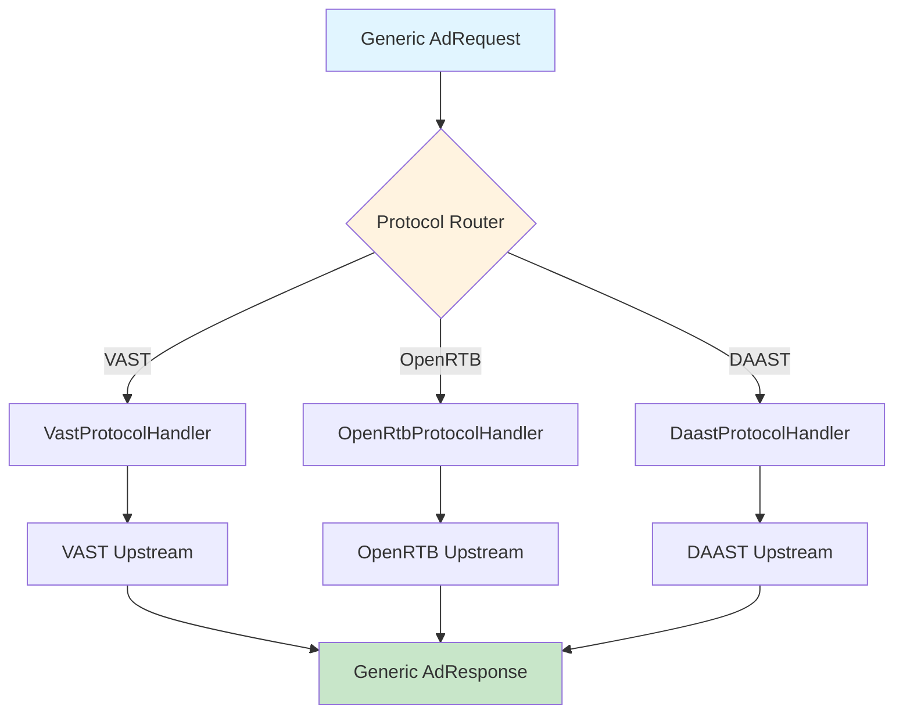

# Protocol-Agnostic Design

This document describes the protocol-agnostic design pattern in xsp-lib, enabling a single unified API to support multiple AdTech protocols (VAST, OpenRTB, DAAST) while maintaining type safety and extensibility.

## Table of Contents

1. [Overview](#overview)
2. [Design Goals](#design-goals)
3. [TypedDict Schemas](#typeddict-schemas)
4. [Extension Pattern](#extension-pattern)
5. [Protocol Handler Interface](#protocol-handler-interface)
6. [Protocol Mappings](#protocol-mappings)
7. [Backward Compatibility](#backward-compatibility)
8. [Code Examples](#code-examples)

## Overview

The protocol-agnostic design allows xsp-lib to support multiple AdTech protocols through a common interface. This enables:

- **Unified API**: Same code works with VAST, OpenRTB, DAAST
- **Type Safety**: Full type hints with mypy --strict compliance
- **Extensibility**: Easy to add new protocols
- **Backward Compatibility**: Existing protocol-specific code continues to work

### Architecture Pattern



## Design Goals

### 1. Protocol Independence

Application code should work with any protocol without changes:

```python
# Same code works with VAST, OpenRTB, or DAAST
async def fetch_ad(upstream: Upstream[AdResponse]) -> AdResponse:
    """Fetch ad - protocol agnostic."""
    request = AdRequest(
        user_id="user_12345",
        width=640,
        height=480,
        device_type="mobile",
    )
    return await upstream.request_ad(request)

# Works with VAST
vast_upstream = create_vast_upstream()
ad = await fetch_ad(vast_upstream)

# Works with OpenRTB
openrtb_upstream = create_openrtb_upstream()
ad = await fetch_ad(openrtb_upstream)
```

### 2. Type Safety

Full type hints with strict mypy compliance:

```python
# MyPy validates types across protocol boundaries
request: AdRequest = AdRequest(user_id="user_123")
response: AdResponse = await upstream.request_ad(request)

# Type error caught at static analysis time
bad_request: AdRequest = {"user_id": 123}  # Error: int not str
```

### 3. Extensibility

Protocol-specific extensions without breaking generic interface:

```python
# Generic request
request = AdRequest(user_id="user_123")

# VAST-specific extension
request["extensions"] = {
    "vast": {
        "pod_size": 3,
        "ad_break": "mid-roll",
    }
}

# OpenRTB-specific extension
request["extensions"] = {
    "openrtb": {
        "bcat": ["IAB25", "IAB26"],  # Blocked categories
        "badv": ["competitor.com"],   # Blocked advertisers
    }
}
```

### 4. Backward Compatibility

Existing protocol-specific code continues to work:

```python
# Existing VAST-specific code (still works)
vast_upstream = VastUpstream(...)
vast_xml = await vast_upstream.request(params={"w": "640", "h": "480"})

# New protocol-agnostic code (also works)
ad_response = await vast_upstream.request_ad(
    AdRequest(width=640, height=480)
)
```

## TypedDict Schemas

### AdRequest Schema

`AdRequest` is a protocol-agnostic request schema using `TypedDict`:

```python
from typing import TypedDict, Any, Literal

class AdRequest(TypedDict, total=False):
    """Protocol-agnostic ad request.
    
    Supports all major AdTech protocols through common fields
    and protocol-specific extensions.
    
    Common Fields:
        request_id: Unique request identifier
        user_id: User identifier for targeting and frequency capping
        session_id: Session identifier for multi-ad sequences
        device_id: Device identifier (IDFA, Android ID, etc.)
        
    Dimensions:
        width: Ad width in pixels
        height: Ad height in pixels
        
    Context:
        content_url: URL where ad will be shown
        content_title: Content title/name
        content_duration: Content duration in seconds (video)
        
    Device Info:
        device_type: Device type (mobile, tablet, desktop, ctv)
        device_make: Device manufacturer (Apple, Samsung, etc.)
        device_model: Device model (iPhone12,1, SM-G960F, etc.)
        os: Operating system (iOS, Android, etc.)
        os_version: OS version
        user_agent: User agent string
        
    Geo:
        ip_address: Client IP address
        country: ISO 3166-1 alpha-2 country code
        region: Region/state code
        city: City name
        zip_code: ZIP/postal code
        lat: Latitude
        lon: Longitude
        
    Ad Placement:
        placement_type: Placement type (banner, video, native, audio)
        ad_position: Position (above-fold, below-fold)
        
    Extensions:
        extensions: Protocol-specific extensions (see Extension Pattern)
    
    Example:
        >>> request = AdRequest(
        ...     request_id="req_123",
        ...     user_id="user_12345",
        ...     width=640,
        ...     height=480,
        ...     device_type="mobile",
        ...     ip_address="203.0.113.42",
        ...     extensions={
        ...         "vast": {"pod_size": 3},
        ...     }
        ... )
    """
    # Identifiers
    request_id: str
    user_id: str
    session_id: str
    device_id: str
    
    # Dimensions
    width: int
    height: int
    
    # Context
    content_url: str
    content_title: str
    content_duration: float
    
    # Device
    device_type: Literal["mobile", "tablet", "desktop", "ctv", "stb"]
    device_make: str
    device_model: str
    os: str
    os_version: str
    user_agent: str
    
    # Geo
    ip_address: str
    country: str
    region: str
    city: str
    zip_code: str
    lat: float
    lon: float
    
    # Placement
    placement_type: Literal["banner", "video", "native", "audio"]
    ad_position: Literal["above-fold", "below-fold", "header", "footer", "sidebar"]
    
    # Protocol-specific extensions
    extensions: dict[str, Any]
```

### AdResponse Schema

`AdResponse` is a protocol-agnostic response schema:

```python
from typing import TypedDict, Any, Literal

class TrackingEvent(TypedDict):
    """Tracking event definition."""
    event_type: str  # impression, start, firstQuartile, etc.
    url: str
    method: Literal["GET", "POST"]

class Creative(TypedDict, total=False):
    """Creative definition."""
    creative_id: str
    creative_url: str
    creative_type: Literal["video", "image", "html", "native"]
    width: int
    height: int
    duration: float  # seconds (for video/audio)
    mime_type: str
    bitrate: int  # kbps

class AdResponse(TypedDict, total=False):
    """Protocol-agnostic ad response.
    
    Normalized response structure that can represent ads from
    any protocol (VAST, OpenRTB, DAAST, etc.).
    
    Identification:
        response_id: Unique response identifier
        ad_id: Ad identifier
        campaign_id: Campaign identifier
        creative_id: Creative identifier
        
    Metadata:
        ad_title: Ad title/name
        advertiser: Advertiser name
        
    Creative:
        creative: Primary creative (see Creative TypedDict)
        companions: Companion creatives (e.g., banner with video)
        
    Pricing:
        price: Bid price or CPM
        currency: Currency code (USD, EUR, etc.)
        
    Tracking:
        impression_urls: Impression tracking URLs
        click_urls: Click tracking URLs
        tracking_events: All tracking events
        
    Metadata:
        duration: Ad duration in seconds (video/audio)
        landing_page_url: Click-through URL
        
    Extensions:
        extensions: Protocol-specific fields
    
    Example:
        >>> response = AdResponse(
        ...     response_id="resp_123",
        ...     ad_id="ad_456",
        ...     ad_title="Summer Sale",
        ...     creative=Creative(
        ...         creative_url="https://cdn.example.com/video.mp4",
        ...         creative_type="video",
        ...         duration=30.0,
        ...     ),
        ...     price=2.50,
        ...     currency="USD",
        ...     impression_urls=["https://track.example.com/imp"],
        ... )
    """
    # Identification
    response_id: str
    ad_id: str
    campaign_id: str
    creative_id: str
    
    # Metadata
    ad_title: str
    advertiser: str
    
    # Creative
    creative: Creative
    companions: list[Creative]
    
    # Pricing
    price: float  # CPM or bid price
    currency: str  # ISO 4217 currency code
    
    # Tracking
    impression_urls: list[str]
    click_urls: list[str]
    tracking_events: list[TrackingEvent]
    
    # Metadata
    duration: float  # seconds
    landing_page_url: str
    
    # Protocol-specific extensions
    extensions: dict[str, Any]
```

## Extension Pattern

The `extensions` field enables protocol-specific data without polluting the common schema.

### Extension Field Structure

```python
# Extensions are nested under protocol name
extensions: dict[str, Any] = {
    "protocol_name": {
        # Protocol-specific fields
    }
}
```

### VAST Extensions

```python
class VastExtensions(TypedDict, total=False):
    """VAST-specific extensions for AdRequest."""
    version: str  # VAST version (2.0, 3.0, 4.0, 4.1, 4.2)
    pod_size: int  # Number of ads in pod
    pod_position: int  # Position within pod (1-indexed)
    ad_break: Literal["pre-roll", "mid-roll", "post-roll"]
    max_duration: float  # Maximum ad duration
    min_duration: float  # Minimum ad duration
    enable_macros: bool  # Enable IAB macro substitution
    validate_xml: bool  # Validate XML structure

# Usage
request = AdRequest(
    user_id="user_123",
    width=640,
    height=480,
    extensions={
        "vast": VastExtensions(
            version="4.2",
            pod_size=3,
            ad_break="pre-roll",
            enable_macros=True,
        )
    }
)
```

### OpenRTB Extensions

```python
class OpenRtbExtensions(TypedDict, total=False):
    """OpenRTB-specific extensions for AdRequest."""
    bcat: list[str]  # Blocked categories (IAB taxonomy)
    badv: list[str]  # Blocked advertiser domains
    bapp: list[str]  # Blocked app bundles
    battr: list[int]  # Blocked creative attributes
    tmax: int  # Max response time (ms)
    test: int  # Test mode flag (0 or 1)
    at: int  # Auction type (1=first price, 2=second price)
    cur: list[str]  # Allowed currencies

# Usage
request = AdRequest(
    user_id="user_123",
    device_type="mobile",
    extensions={
        "openrtb": OpenRtbExtensions(
            bcat=["IAB25", "IAB26"],  # Block sensitive categories
            badv=["competitor.com"],
            tmax=300,  # 300ms timeout per OpenRTB 2.6 §4.1
            at=2,  # Second-price auction
        )
    }
)
```

### DAAST Extensions

```python
class DaastExtensions(TypedDict, total=False):
    """DAAST-specific extensions for AdRequest.
    
    Note: DAAST is deprecated. Use VAST 4.1+ with adType='audio' instead.
    """
    audio_format: Literal["mp3", "aac", "ogg"]
    max_bitrate: int  # kbps
    min_bitrate: int  # kbps

# Usage (deprecated - use VAST instead)
request = AdRequest(
    user_id="user_123",
    placement_type="audio",
    extensions={
        "vast": VastExtensions(  # Use VAST, not DAAST
            version="4.2",
        ),
        # Legacy DAAST support
        "daast": DaastExtensions(
            audio_format="aac",
            max_bitrate=128,
        )
    }
)
```

## Protocol Handler Interface

Each protocol implements the `ProtocolHandler` interface to transform between generic schemas and protocol-specific formats.

### ProtocolHandler Protocol

```python
from typing import Protocol, TypeVar, Generic

T_Request = TypeVar("T_Request")  # Protocol-specific request type
T_Response = TypeVar("T_Response")  # Protocol-specific response type

class ProtocolHandler(Protocol, Generic[T_Request, T_Response]):
    """Protocol handler interface.
    
    Transforms between generic AdRequest/AdResponse and
    protocol-specific request/response formats.
    """
    
    def encode_request(self, request: AdRequest) -> T_Request:
        """Transform AdRequest to protocol-specific format.
        
        Args:
            request: Generic ad request
        
        Returns:
            Protocol-specific request (e.g., VAST params, OpenRTB BidRequest)
        
        Example:
            >>> handler = VastProtocolHandler()
            >>> request = AdRequest(user_id="user_123", width=640, height=480)
            >>> vast_params = handler.encode_request(request)
            >>> # vast_params = {"uid": "user_123", "w": "640", "h": "480"}
        """
        ...
    
    def decode_response(self, response: T_Response) -> AdResponse:
        """Transform protocol-specific response to AdResponse.
        
        Args:
            response: Protocol-specific response (e.g., VAST XML, BidResponse)
        
        Returns:
            Generic ad response
        
        Example:
            >>> handler = VastProtocolHandler()
            >>> vast_xml = "<VAST version='4.2'>...</VAST>"
            >>> ad_response = handler.decode_response(vast_xml)
            >>> # ad_response = AdResponse(ad_id=..., creative=...)
        """
        ...
    
    async def validate_request(self, request: T_Request) -> bool:
        """Validate protocol-specific request.
        
        Args:
            request: Protocol-specific request
        
        Returns:
            True if valid
        
        Raises:
            ValidationError: If request is invalid
        """
        ...
    
    async def validate_response(self, response: T_Response) -> bool:
        """Validate protocol-specific response.
        
        Args:
            response: Protocol-specific response
        
        Returns:
            True if valid
        
        Raises:
            ValidationError: If response is invalid
        """
        ...
```

## Protocol Mappings

### VAST Mapping

```python
from typing import Any
from xml.etree import ElementTree as ET

class VastProtocolHandler:
    """VAST protocol handler implementing ProtocolHandler interface."""
    
    def encode_request(self, request: AdRequest) -> dict[str, str]:
        """Transform AdRequest to VAST query parameters.
        
        Maps generic fields to VAST-specific params:
        - user_id → uid
        - width → w
        - height → h
        - content_url → url
        - ip_address → ip
        """
        params: dict[str, str] = {}
        
        # Map common fields
        if "user_id" in request:
            params["uid"] = request["user_id"]
        if "width" in request and "height" in request:
            params["w"] = str(request["width"])
            params["h"] = str(request["height"])
        if "content_url" in request:
            params["url"] = request["content_url"]
        if "ip_address" in request:
            params["ip"] = request["ip_address"]
        
        # Merge VAST extensions
        if "extensions" in request and "vast" in request["extensions"]:
            vast_ext = request["extensions"]["vast"]
            
            if "pod_position" in vast_ext:
                params["pod_pos"] = str(vast_ext["pod_position"])
            if "max_duration" in vast_ext:
                params["max_duration"] = str(vast_ext["max_duration"])
        
        return params
    
    def decode_response(self, xml: str) -> AdResponse:
        """Parse VAST XML to AdResponse.
        
        Extracts common fields from VAST structure:
        - Ad@id → ad_id
        - AdTitle → ad_title
        - Advertiser → advertiser
        - MediaFile → creative
        - Impression → impression_urls
        - ClickThrough → landing_page_url
        """
        root = ET.fromstring(xml)
        ad = root.find(".//Ad")
        inline = ad.find("InLine") if ad is not None else None
        
        if inline is None:
            raise ValueError("VAST response must contain InLine ad")
        
        # Extract ad metadata
        ad_id = ad.get("id", "") if ad is not None else ""
        ad_title = inline.findtext("AdTitle")
        advertiser = inline.findtext("Advertiser")
        
        # Extract creative
        linear = inline.find(".//Linear")
        media_file = linear.find(".//MediaFile") if linear is not None else None
        
        creative = Creative(
            creative_url=media_file.text if media_file is not None else "",
            creative_type="video",
            duration=self._parse_duration(linear.findtext("Duration", "")) if linear is not None else 0.0,
            mime_type=media_file.get("type", "") if media_file is not None else "",
        )
        
        # Extract tracking URLs
        impression_urls = [
            imp.text for imp in inline.findall(".//Impression")
            if imp.text is not None
        ]
        
        click_through = linear.find(".//ClickThrough") if linear is not None else None
        landing_page_url = click_through.text if click_through is not None else ""
        
        # Build response
        response = AdResponse(
            ad_id=ad_id,
            ad_title=ad_title or "",
            advertiser=advertiser or "",
            creative=creative,
            impression_urls=impression_urls,
            landing_page_url=landing_page_url,
            extensions={
                "vast": {
                    "version": root.get("version"),
                    "xml": xml,  # Preserve original XML
                }
            }
        )
        
        return response
    
    def _parse_duration(self, duration_str: str) -> float:
        """Parse VAST duration (HH:MM:SS.mmm) to seconds."""
        if not duration_str:
            return 0.0
        
        parts = duration_str.split(":")
        hours = int(parts[0]) if len(parts) > 2 else 0
        minutes = int(parts[1]) if len(parts) > 1 else 0
        seconds = float(parts[2]) if len(parts) > 0 else 0.0
        
        return hours * 3600 + minutes * 60 + seconds
    
    async def validate_request(self, params: dict[str, str]) -> bool:
        """Validate VAST parameters."""
        # Basic validation: width and height typically required
        required = ["w", "h"]
        return all(key in params for key in required)
    
    async def validate_response(self, xml: str) -> bool:
        """Validate VAST XML structure."""
        try:
            root = ET.fromstring(xml)
            return root.tag == "VAST"
        except ET.ParseError:
            return False
```

### OpenRTB Mapping

```python
from typing import Any
import json

class OpenRtbProtocolHandler:
    """OpenRTB 2.6 protocol handler implementing ProtocolHandler interface."""
    
    def encode_request(self, request: AdRequest) -> dict[str, Any]:
        """Transform AdRequest to OpenRTB 2.6 BidRequest.
        
        Maps generic fields to OpenRTB structure per specification:
        - request_id → BidRequest.id
        - user_id → BidRequest.user.id
        - device_id → BidRequest.device.ifa
        - width/height → BidRequest.imp[].banner.w/h
        - ip_address → BidRequest.device.ip
        """
        from uuid import uuid4
        
        # Build BidRequest per OpenRTB 2.6 schema
        bid_request = {
            "id": request.get("request_id", str(uuid4())),
            "imp": [
                {
                    "id": "1",
                    "banner": {
                        "w": request.get("width", 300),
                        "h": request.get("height", 250),
                        "pos": self._map_ad_position(request.get("ad_position")),
                    }
                }
            ],
            "device": {
                "ua": request.get("user_agent"),
                "ip": request.get("ip_address"),
                "make": request.get("device_make"),
                "model": request.get("device_model"),
                "os": request.get("os"),
                "osv": request.get("os_version"),
                "ifa": request.get("device_id"),
            },
            "user": {
                "id": request.get("user_id"),
            },
            "site": {
                "page": request.get("content_url"),
            },
        }
        
        # Apply OpenRTB extensions
        if "extensions" in request and "openrtb" in request["extensions"]:
            openrtb_ext = request["extensions"]["openrtb"]
            
            if "bcat" in openrtb_ext:
                bid_request["bcat"] = openrtb_ext["bcat"]
            if "badv" in openrtb_ext:
                bid_request["badv"] = openrtb_ext["badv"]
            if "tmax" in openrtb_ext:
                bid_request["tmax"] = openrtb_ext["tmax"]
            if "at" in openrtb_ext:
                bid_request["at"] = openrtb_ext["at"]
        
        return bid_request
    
    def decode_response(self, bid_response: dict[str, Any]) -> AdResponse:
        """Parse OpenRTB BidResponse to AdResponse.
        
        Extracts fields from BidResponse structure:
        - BidResponse.id → response_id
        - SeatBid.bid[].price → price
        - SeatBid.bid[].adm → creative (ad markup)
        - SeatBid.bid[].nurl → impression_url
        """
        # Extract first bid
        seat_bid = bid_response.get("seatbid", [{}])[0]
        bid = seat_bid.get("bid", [{}])[0]
        
        # Build response
        response = AdResponse(
            response_id=bid_response.get("id", ""),
            ad_id=bid.get("adid", ""),
            campaign_id=bid.get("cid", ""),
            creative_id=bid.get("crid", ""),
            price=bid.get("price", 0.0),
            currency=bid_response.get("cur", "USD"),
            impression_urls=[bid.get("nurl", "")] if bid.get("nurl") else [],
            landing_page_url=self._extract_click_url(bid.get("adm", "")),
            extensions={
                "openrtb": {
                    "adm": bid.get("adm"),  # Ad markup
                    "adomain": bid.get("adomain", []),
                    "iurl": bid.get("iurl"),  # Impression URL
                }
            }
        )
        
        return response
    
    def _map_ad_position(self, position: str | None) -> int:
        """Map generic position to OpenRTB position code."""
        mapping = {
            "above-fold": 1,
            "below-fold": 3,
            "header": 1,
            "footer": 3,
            "sidebar": 2,
        }
        return mapping.get(position or "", 0)
    
    def _extract_click_url(self, adm: str) -> str:
        """Extract click URL from ad markup."""
        # Simplified - would need actual HTML parsing
        return ""
    
    async def validate_request(self, bid_request: dict[str, Any]) -> bool:
        """Validate BidRequest against OpenRTB 2.6 schema."""
        # Basic validation: id and imp required
        return "id" in bid_request and "imp" in bid_request
    
    async def validate_response(self, bid_response: dict[str, Any]) -> bool:
        """Validate BidResponse against OpenRTB 2.6 schema."""
        # Basic validation: id required
        return "id" in bid_response
```

## Backward Compatibility

### Strategy

1. **Dual API**: Support both protocol-specific and generic APIs
2. **Gradual Migration**: Deprecate old API over time
3. **Adapter Pattern**: Wrap existing implementations

### Dual API Example

```python
class VastUpstream(BaseUpstream[str]):
    """VAST upstream with both APIs."""
    
    # Protocol-specific API (existing)
    async def request(
        self,
        *,
        params: dict[str, Any] | None = None,
        **kwargs: Any,
    ) -> str:
        """Protocol-specific request (backward compatible)."""
        # Existing implementation
        ...
    
    # Generic API (new)
    async def request_ad(self, request: AdRequest) -> AdResponse:
        """Generic ad request (protocol-agnostic).
        
        Transforms AdRequest to VAST params, fetches XML,
        and returns normalized AdResponse.
        """
        # Transform to VAST params
        handler = VastProtocolHandler()
        params = handler.encode_request(request)
        
        # Fetch VAST XML
        xml = await self.request(params=params)
        
        # Transform to AdResponse
        return handler.decode_response(xml)
```

### Migration Path

```python
# Phase 1: Old API (still works)
vast_upstream = VastUpstream(...)
xml = await vast_upstream.request(params={"w": "640", "h": "480"})
# Parse XML manually

# Phase 2: Hybrid (both work)
xml = await vast_upstream.request(params={"w": "640", "h": "480"})
# OR
ad_response = await vast_upstream.request_ad(
    AdRequest(width=640, height=480)
)

# Phase 3: New API (recommended)
ad_response = await vast_upstream.request_ad(
    AdRequest(width=640, height=480)
)
# No manual parsing needed
```

## Code Examples

### Complete Example: Protocol-Agnostic Ad Serving

```python
"""Complete example of protocol-agnostic ad serving."""
import asyncio
from typing import Protocol

class AdUpstream(Protocol):
    """Protocol-agnostic ad upstream interface."""
    
    async def request_ad(self, request: AdRequest) -> AdResponse:
        """Request ad (protocol-agnostic)."""
        ...

async def serve_ad(
    upstream: AdUpstream,
    user_id: str,
    device_type: str,
) -> AdResponse:
    """Serve ad - works with any protocol.
    
    This function works identically with VAST, OpenRTB,
    or any other protocol implementing AdUpstream.
    """
    # Build generic request
    request = AdRequest(
        user_id=user_id,
        device_type=device_type,
        width=640,
        height=480,
    )
    
    # Fetch ad (protocol-agnostic)
    ad_response = await upstream.request_ad(request)
    
    # Process response (protocol-agnostic)
    print(f"Ad: {ad_response['ad_title']}")
    print(f"Creative: {ad_response['creative']['creative_url']}")
    print(f"Price: ${ad_response.get('price', 0):.2f}")
    
    return ad_response

async def main() -> None:
    """Demonstrate protocol-agnostic ad serving."""
    from xsp.transports.http import HttpTransport
    from xsp.protocols.vast import VastUpstream
    
    # Create VAST upstream
    vast_upstream = VastUpstream(
        transport=HttpTransport(),
        endpoint="https://ads.example.com/vast",
    )
    
    # Serve ad using VAST
    ad = await serve_ad(
        upstream=vast_upstream,
        user_id="user_12345",
        device_type="mobile",
    )
    
    # Same function works with OpenRTB
    # openrtb_upstream = OpenRtbUpstream(...)
    # ad = await serve_ad(
    #     upstream=openrtb_upstream,
    #     user_id="user_12345",
    #     device_type="mobile",
    # )

asyncio.run(main())
```

### Extension Example: VAST Pod with Protocol-Agnostic API

```python
async def serve_ad_pod(
    upstream: AdUpstream,
    pod_size: int = 3,
) -> list[AdResponse]:
    """Serve multi-ad pod using protocol-agnostic API."""
    ads: list[AdResponse] = []
    
    for position in range(1, pod_size + 1):
        # Use VAST-specific extensions
        request = AdRequest(
            user_id="user_12345",
            width=640,
            height=480,
            extensions={
                "vast": {
                    "pod_size": pod_size,
                    "pod_position": position,
                    "ad_break": "pre-roll",
                }
            }
        )
        
        ad = await upstream.request_ad(request)
        ads.append(ad)
    
    return ads
```

## References

- [Final Architecture Documentation](./final-architecture.md)
- [Session Management](./session-management.md)
- [Terminology Guide](./terminology.md)
- [TypedDict Documentation](https://docs.python.org/3/library/typing.html#typing.TypedDict)
- [IAB OpenRTB 2.6 Specification](https://www.iab.com/wp-content/uploads/2016/03/OpenRTB-API-Specification-Version-2-6.pdf)
- [IAB VAST 4.2 Specification](https://iabtechlab.com/wp-content/uploads/2019/06/VAST_4.2_final_june26.pdf)
- [Protocol-Oriented Programming](https://www.python.org/dev/peps/pep-0544/)

---

**Document Version**: 1.0  
**Last Updated**: 2025-12-10  
**Status**: Production Ready
