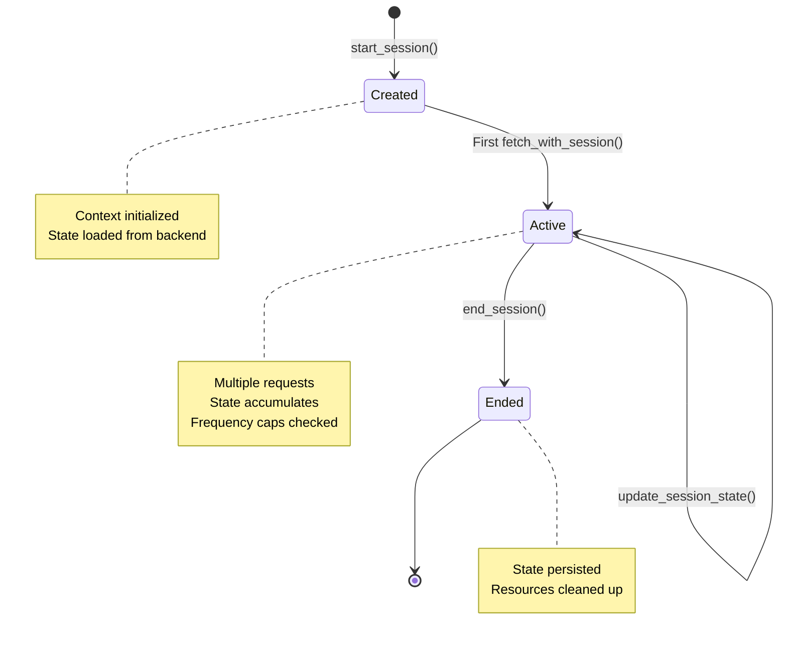

# Session Management Architecture

This document describes the session management system in xsp-lib, which enables stateful interactions with upstream AdTech services, frequency capping, budget tracking, and multi-ad pod handling.

## Table of Contents

1. [Overview](#overview)
2. [SessionContext Design](#sessioncontext-design)
3. [UpstreamSession Protocol](#upstreamsession-protocol)
4. [Session Lifecycle](#session-lifecycle)
5. [Frequency Capping Integration](#frequency-capping-integration)
6. [Budget Tracking](#budget-tracking)
7. [Multi-Ad Pod Handling](#multi-ad-pod-handling)
8. [State Backends](#state-backends)
9. [Usage Examples](#usage-examples)

## Overview

Session management in xsp-lib provides a structured approach to maintaining state across multiple ad requests. This is critical for:

- **Frequency Capping**: Limiting ad impressions per user per time period
- **Budget Tracking**: Monitoring campaign spend and pausing when exhausted
- **Ad Pod Management**: Coordinating multiple ads in a single session (VMAP)
- **User Experience**: Ensuring ad diversity and preventing ad fatigue
- **Compliance**: Meeting advertiser requirements and IAB standards

### Design Philosophy

The session management system follows these principles:

1. **Immutability**: `SessionContext` is immutable to prevent unintended state mutations
2. **Separation of Concerns**: Session state separate from request/response data
3. **Backend Agnostic**: State can be stored in Redis, DynamoDB, or in-memory
4. **Type Safety**: Full type hints with strict mypy compliance
5. **Async First**: All operations are async for non-blocking I/O

## SessionContext Design

`SessionContext` is an immutable dataclass representing the context for a session of ad requests.

### Definition

```python
from dataclasses import dataclass, field
from typing import Any

@dataclass(frozen=True)
class SessionContext:
    """Immutable session context for ad requests.
    
    The frozen=True parameter ensures immutability - once created,
    the context cannot be modified. This prevents bugs from
    unintended mutations and enables safe sharing across async tasks.
    
    Attributes:
        session_id: Unique session identifier (UUID recommended)
        user_id: User identifier for frequency capping and personalization
        device_id: Device identifier (IDFA, Android ID, etc.)
        ip_address: Client IP address for geo-targeting
        user_agent: User agent string for device detection
        content_url: URL of content where ad will be shown
        metadata: Additional session metadata (arbitrary key-value pairs)
    
    Example:
        >>> from uuid import uuid4
        >>> context = SessionContext(
        ...     session_id=str(uuid4()),
        ...     user_id="user_12345",
        ...     device_id="IDFA-ABC-123",
        ...     ip_address="203.0.113.42",
        ...     metadata={"app_version": "2.1.0", "platform": "ios"}
        ... )
        >>> # Cannot modify: context.user_id = "other" raises FrozenInstanceError
    """
    session_id: str
    user_id: str | None = None
    device_id: str | None = None
    ip_address: str | None = None
    user_agent: str | None = None
    content_url: str | None = None
    metadata: dict[str, Any] = field(default_factory=dict)
    
    def with_metadata(self, **kwargs: Any) -> "SessionContext":
        """Create new context with updated metadata.
        
        Since SessionContext is immutable, this method creates a new
        instance with the specified metadata keys added/updated.
        
        Args:
            **kwargs: Metadata keys to add or update
        
        Returns:
            New SessionContext with updated metadata
        
        Example:
            >>> context = SessionContext(session_id="sess_1")
            >>> new_context = context.with_metadata(
            ...     placement="header",
            ...     ad_format="video"
            ... )
            >>> assert "placement" in new_context.metadata
            >>> assert context.metadata == {}  # Original unchanged
        """
        from dataclasses import replace
        merged_metadata = {**self.metadata, **kwargs}
        return replace(self, metadata=merged_metadata)
```

### Immutability Benefits

**Why Immutable?**

1. **Thread Safety**: Safe to share across async tasks without locks
2. **Predictability**: Context cannot change unexpectedly
3. **Debugging**: Easier to reason about state flow
4. **Testing**: Reproducible test scenarios

**Example of Safe Sharing**:
```python
import asyncio

context = SessionContext(session_id="sess_1", user_id="user_1")

async def fetch_vast(ctx: SessionContext) -> str:
    # Context cannot be modified - safe to use concurrently
    upstream = VastUpstream(...)
    return await upstream.fetch_with_session(ctx)

async def fetch_analytics(ctx: SessionContext) -> None:
    # Same context, different operation - no mutation risk
    analytics = AnalyticsUpstream(...)
    await analytics.track_with_session(ctx)

# Safe concurrent execution
await asyncio.gather(
    fetch_vast(context),
    fetch_analytics(context),
)
```

## UpstreamSession Protocol

`UpstreamSession` is a protocol defining stateful upstream interactions.

### Protocol Definition

```python
from typing import Any, Protocol

class UpstreamSession(Protocol):
    """Stateful session protocol for upstream services.
    
    This protocol enables upstreams to maintain state across multiple
    requests within a session. State is managed separately from the
    immutable SessionContext.
    """
    
    async def start_session(self, context: SessionContext) -> None:
        """Initialize session with context.
        
        Called once at session start to initialize state. The context
        provides immutable session parameters, while mutable state
        is managed internally by the implementation.
        
        Args:
            context: Immutable session context
        
        Raises:
            SessionError: If session already started
        
        Example:
            >>> session = VastSessionUpstream(...)
            >>> context = SessionContext(session_id="sess_1")
            >>> await session.start_session(context)
        """
        ...
    
    async def fetch_with_session(
        self,
        params: dict[str, Any] | None = None,
        headers: dict[str, str] | None = None,
    ) -> Any:
        """Fetch using session state.
        
        Uses the session context and accumulated state to make
        a request. State may be updated as a side effect (e.g.,
        incrementing frequency cap counter).
        
        Args:
            params: Request-specific parameters
            headers: Request-specific headers
        
        Returns:
            Response data (type depends on upstream)
        
        Raises:
            SessionError: If session not started
            FrequencyCapExceeded: If user has seen too many ads
        
        Example:
            >>> result = await session.fetch_with_session(
            ...     params={"w": "640", "h": "480"}
            ... )
        """
        ...
    
    async def update_session_state(self, state: dict[str, Any]) -> None:
        """Update session state.
        
        Explicitly update session state. Useful for:
        - Recording impressions
        - Updating frequency cap counters
        - Tracking budget spend
        - Accumulating analytics data
        
        Args:
            state: State updates to apply
        
        Example:
            >>> await session.update_session_state({
            ...     "impressions_shown": 3,
            ...     "total_spend": 1.50,
            ... })
        """
        ...
    
    async def get_session_state(self) -> dict[str, Any]:
        """Get current session state.
        
        Returns:
            Current mutable session state
        
        Example:
            >>> state = await session.get_session_state()
            >>> print(f"Impressions: {state['impressions_shown']}")
        """
        ...
    
    async def end_session(self) -> None:
        """Clean up session resources.
        
        Called when session completes. Should:
        - Flush any pending state updates
        - Close connections
        - Release resources
        - Optionally persist final state
        
        Example:
            >>> await session.end_session()
        """
        ...
```

### Reference Implementation

```python
from typing import Any
from xsp.core.base import BaseUpstream
from xsp.core.exceptions import SessionError

class SessionUpstream(BaseUpstream[T]):
    """Base implementation of UpstreamSession protocol.
    
    Provides session management on top of BaseUpstream.
    """
    
    def __init__(self, *args: Any, state_backend: StateBackend | None = None, **kwargs: Any):
        """Initialize session upstream.
        
        Args:
            *args: Passed to BaseUpstream
            state_backend: Optional state backend for persistence
            **kwargs: Passed to BaseUpstream
        """
        super().__init__(*args, **kwargs)
        self.state_backend = state_backend
        self._context: SessionContext | None = None
        self._session_state: dict[str, Any] = {}
    
    async def start_session(self, context: SessionContext) -> None:
        """Initialize session with context."""
        if self._context is not None:
            raise SessionError("Session already started")
        
        self._context = context
        self._session_state = {}
        
        # Load persisted state if backend available
        if self.state_backend:
            key = f"session:{context.session_id}"
            persisted = await self.state_backend.get(key)
            if persisted:
                self._session_state = persisted
    
    async def fetch_with_session(
        self,
        params: dict[str, Any] | None = None,
        headers: dict[str, str] | None = None,
    ) -> T:
        """Fetch using session state."""
        if self._context is None:
            raise SessionError("Session not started - call start_session() first")
        
        # Merge session context into params
        merged_params = params or {}
        if self._context.user_id:
            merged_params["user_id"] = self._context.user_id
        if self._context.device_id:
            merged_params["device_id"] = self._context.device_id
        
        # Use parent fetch
        result = await self.fetch(params=merged_params, headers=headers)
        
        # Update session state (e.g., increment request count)
        self._session_state["request_count"] = self._session_state.get("request_count", 0) + 1
        
        return result
    
    async def update_session_state(self, state: dict[str, Any]) -> None:
        """Update session state."""
        if self._context is None:
            raise SessionError("Session not started")
        
        self._session_state.update(state)
        
        # Persist if backend available
        if self.state_backend:
            key = f"session:{self._context.session_id}"
            await self.state_backend.set(key, self._session_state, ttl=3600)
    
    async def get_session_state(self) -> dict[str, Any]:
        """Get current session state."""
        return self._session_state.copy()
    
    async def end_session(self) -> None:
        """Clean up session resources."""
        if self.state_backend and self._context:
            # Final state persist
            key = f"session:{self._context.session_id}"
            await self.state_backend.set(key, self._session_state, ttl=86400)
        
        self._context = None
        self._session_state = {}
        
        await self.close()
```

## Session Lifecycle

The session lifecycle consists of four phases: creation, requests, state updates, and cleanup.



### Phase 1: Creation

```python
from uuid import uuid4
from xsp.protocols.vast import VastUpstream
from xsp.transports.http import HttpTransport

# Create upstream with session support
upstream = SessionUpstream(
    transport=HttpTransport(),
    decoder=lambda b: b.decode('utf-8'),
    endpoint="https://ads.example.com/vast",
    state_backend=redis_backend,  # Optional persistence
)

# Create immutable session context
context = SessionContext(
    session_id=str(uuid4()),
    user_id="user_12345",
    device_id="IDFA-ABC-123",
    ip_address="203.0.113.42",
    metadata={"placement": "pre-roll"}
)

# Initialize session
await upstream.start_session(context)
```

### Phase 2: Requests

```python
# First ad request
ad1 = await upstream.fetch_with_session(
    params={"w": "640", "h": "480", "pos": "1"}
)

# Check session state
state = await upstream.get_session_state()
print(f"Request count: {state['request_count']}")  # 1

# Second ad request (different position)
ad2 = await upstream.fetch_with_session(
    params={"w": "640", "h": "480", "pos": "2"}
)

# State automatically updated
state = await upstream.get_session_state()
print(f"Request count: {state['request_count']}")  # 2
```

### Phase 3: State Updates

```python
# Explicitly update state (e.g., after impression)
await upstream.update_session_state({
    "impressions_shown": 2,
    "last_impression_time": time.time(),
    "campaign_ids": ["camp_1", "camp_2"],
})

# State persisted to backend if configured
```

### Phase 4: Cleanup

```python
# End session when done
await upstream.end_session()

# Session state persisted with TTL
# Resources released
```

### Complete Example

```python
async def serve_ad_session() -> None:
    """Complete session lifecycle example."""
    upstream = SessionUpstream(
        transport=HttpTransport(),
        decoder=lambda b: b.decode('utf-8'),
        endpoint="https://ads.example.com/vast",
        state_backend=RedisBackend(host="localhost"),
    )
    
    context = SessionContext(
        session_id=str(uuid4()),
        user_id="user_12345",
        metadata={"session_start": time.time()}
    )
    
    try:
        # Phase 1: Creation
        await upstream.start_session(context)
        
        # Phase 2: Requests
        for position in range(1, 4):
            ad = await upstream.fetch_with_session(
                params={"pos": str(position)}
            )
            print(f"Served ad at position {position}")
            
            # Phase 3: State Updates
            await upstream.update_session_state({
                "impressions_shown": position,
                "last_position": position,
            })
    
    finally:
        # Phase 4: Cleanup
        await upstream.end_session()
```

## Frequency Capping Integration

Frequency capping limits the number of times a user sees the same ad or campaign.

### FrequencyCapper Implementation

```python
from typing import Any
from xsp.core.exceptions import FrequencyCapExceeded

class FrequencyCapper:
    """Frequency capping enforcement using state backend.
    
    Supports:
    - Per-campaign caps
    - Per-creative caps
    - Time-based windows (hourly, daily, lifetime)
    - Multiple cap rules
    """
    
    def __init__(
        self,
        backend: StateBackend,
        default_cap: int = 3,
        window_seconds: int = 86400,  # 24 hours
    ):
        """Initialize frequency capper.
        
        Args:
            backend: State backend for persistence
            default_cap: Default maximum impressions
            window_seconds: Time window for cap (seconds)
        """
        self.backend = backend
        self.default_cap = default_cap
        self.window_seconds = window_seconds
    
    async def check_cap(
        self,
        user_id: str,
        campaign_id: str,
        max_impressions: int | None = None,
    ) -> bool:
        """Check if user has exceeded frequency cap.
        
        Args:
            user_id: User identifier
            campaign_id: Campaign identifier
            max_impressions: Override default cap
        
        Returns:
            True if under cap, False if cap exceeded
        """
        cap = max_impressions or self.default_cap
        key = self._make_key(user_id, campaign_id)
        
        count = await self.backend.get(key)
        if count is None:
            return True  # No impressions yet
        
        return count < cap
    
    async def record_impression(
        self,
        user_id: str,
        campaign_id: str,
    ) -> int:
        """Record impression and return new count.
        
        Args:
            user_id: User identifier
            campaign_id: Campaign identifier
        
        Returns:
            New impression count
        
        Raises:
            FrequencyCapExceeded: If cap would be exceeded
        """
        key = self._make_key(user_id, campaign_id)
        
        # Atomic increment
        new_count = await self.backend.increment(key)
        
        # Set TTL on first impression
        if new_count == 1:
            await self.backend.set(key, new_count, ttl=self.window_seconds)
        
        return new_count
    
    async def get_remaining(
        self,
        user_id: str,
        campaign_id: str,
        max_impressions: int | None = None,
    ) -> int:
        """Get remaining impressions before cap.
        
        Args:
            user_id: User identifier
            campaign_id: Campaign identifier
            max_impressions: Override default cap
        
        Returns:
            Remaining impressions (0 if cap exceeded)
        """
        cap = max_impressions or self.default_cap
        key = self._make_key(user_id, campaign_id)
        
        count = await self.backend.get(key) or 0
        remaining = cap - count
        return max(0, remaining)
    
    def _make_key(self, user_id: str, campaign_id: str) -> str:
        """Generate cache key for frequency cap."""
        return f"freq_cap:{user_id}:{campaign_id}"
```

### Session Integration with Frequency Capping

```python
class FrequencyCappedSessionUpstream(SessionUpstream[T]):
    """Session upstream with frequency capping."""
    
    def __init__(
        self,
        *args: Any,
        frequency_capper: FrequencyCapper,
        **kwargs: Any,
    ):
        super().__init__(*args, **kwargs)
        self.frequency_capper = frequency_capper
    
    async def fetch_with_session(
        self,
        campaign_id: str,
        params: dict[str, Any] | None = None,
        **kwargs: Any,
    ) -> T:
        """Fetch with frequency cap check."""
        if self._context is None or self._context.user_id is None:
            raise SessionError("Session context missing user_id")
        
        # Check frequency cap
        can_serve = await self.frequency_capper.check_cap(
            user_id=self._context.user_id,
            campaign_id=campaign_id,
        )
        
        if not can_serve:
            raise FrequencyCapExceeded(
                f"User {self._context.user_id} exceeded cap for campaign {campaign_id}"
            )
        
        # Fetch ad
        result = await super().fetch_with_session(params=params, **kwargs)
        
        # Record impression
        await self.frequency_capper.record_impression(
            user_id=self._context.user_id,
            campaign_id=campaign_id,
        )
        
        return result
```

### Usage Example

```python
async def serve_with_frequency_cap() -> None:
    """Serve ads with frequency capping."""
    redis = RedisBackend(host="localhost")
    capper = FrequencyCapper(
        backend=redis,
        default_cap=3,  # Max 3 impressions
        window_seconds=86400,  # Per 24 hours
    )
    
    upstream = FrequencyCappedSessionUpstream(
        transport=HttpTransport(),
        decoder=lambda b: b.decode('utf-8'),
        endpoint="https://ads.example.com/vast",
        state_backend=redis,
        frequency_capper=capper,
    )
    
    context = SessionContext(
        session_id=str(uuid4()),
        user_id="user_12345",
    )
    
    await upstream.start_session(context)
    
    try:
        # First 3 impressions succeed
        for i in range(3):
            ad = await upstream.fetch_with_session(campaign_id="camp_1")
            print(f"Impression {i+1}: {ad}")
        
        # 4th impression fails with FrequencyCapExceeded
        await upstream.fetch_with_session(campaign_id="camp_1")
    
    except FrequencyCapExceeded as e:
        print(f"Cap exceeded: {e}")
    
    finally:
        await upstream.end_session()
```

## Budget Tracking

Budget tracking monitors campaign spend and pauses campaigns when budget exhausted.

### BudgetTracker Implementation

```python
from decimal import Decimal

class BudgetTracker:
    """Track campaign budget and spend."""
    
    def __init__(self, backend: StateBackend):
        self.backend = backend
    
    async def set_budget(self, campaign_id: str, budget: Decimal) -> None:
        """Set campaign budget.
        
        Args:
            campaign_id: Campaign identifier
            budget: Total budget in currency units
        """
        key = f"budget:{campaign_id}"
        await self.backend.set(key, {
            "total": float(budget),
            "spent": 0.0,
            "remaining": float(budget),
        })
    
    async def record_spend(
        self,
        campaign_id: str,
        amount: Decimal,
    ) -> dict[str, float]:
        """Record spend and return updated budget.
        
        Args:
            campaign_id: Campaign identifier
            amount: Spend amount
        
        Returns:
            Updated budget dict with total, spent, remaining
        
        Raises:
            BudgetExceeded: If spend would exceed budget
        """
        key = f"budget:{campaign_id}"
        budget = await self.backend.get(key)
        
        if budget is None:
            raise ValueError(f"No budget set for campaign {campaign_id}")
        
        new_spent = budget["spent"] + float(amount)
        new_remaining = budget["total"] - new_spent
        
        if new_remaining < 0:
            raise BudgetExceeded(
                f"Campaign {campaign_id} budget exceeded: "
                f"spent {new_spent}, budget {budget['total']}"
            )
        
        updated = {
            "total": budget["total"],
            "spent": new_spent,
            "remaining": new_remaining,
        }
        
        await self.backend.set(key, updated)
        return updated
    
    async def get_remaining(self, campaign_id: str) -> Decimal:
        """Get remaining budget.
        
        Args:
            campaign_id: Campaign identifier
        
        Returns:
            Remaining budget amount
        """
        key = f"budget:{campaign_id}"
        budget = await self.backend.get(key)
        
        if budget is None:
            return Decimal("0")
        
        return Decimal(str(budget["remaining"]))
```

## Multi-Ad Pod Handling

VMAP (Video Multiple Ad Playlist) enables scheduling multiple ads in a single session.

### VMAP Session Example

```python
from typing import Any
from xsp.protocols.vast import VmapUpstream

class VmapSessionUpstream(SessionUpstream[str]):
    """Session upstream for VMAP multi-ad pods."""
    
    async def fetch_ad_pod(
        self,
        pod_size: int = 3,
        params: dict[str, Any] | None = None,
    ) -> list[str]:
        """Fetch multiple ads for ad pod.
        
        Args:
            pod_size: Number of ads in pod
            params: Request parameters
        
        Returns:
            List of VAST XML responses for each ad
        """
        if self._context is None:
            raise SessionError("Session not started")
        
        ads: list[str] = []
        
        for position in range(1, pod_size + 1):
            # Add position to params
            pod_params = {**(params or {}), "pod_pos": str(position)}
            
            # Fetch ad for this position
            ad = await self.fetch_with_session(params=pod_params)
            ads.append(ad)
            
            # Update session state
            await self.update_session_state({
                f"pod_position_{position}": True,
                "total_pod_size": pod_size,
            })
        
        return ads
```

### Usage Example

```python
async def serve_ad_pod() -> None:
    """Serve multi-ad pod with VMAP."""
    upstream = VmapSessionUpstream(
        transport=HttpTransport(),
        decoder=lambda b: b.decode('utf-8'),
        endpoint="https://ads.example.com/vmap",
        state_backend=RedisBackend(),
    )
    
    context = SessionContext(
        session_id=str(uuid4()),
        user_id="user_12345",
        metadata={"content_duration": 600},  # 10 minutes
    )
    
    await upstream.start_session(context)
    
    try:
        # Fetch 3-ad pod
        ads = await upstream.fetch_ad_pod(
            pod_size=3,
            params={"content_id": "video_123"}
        )
        
        print(f"Fetched {len(ads)} ads for pod")
        
        # Session state tracks pod completion
        state = await upstream.get_session_state()
        print(f"Pod state: {state}")
    
    finally:
        await upstream.end_session()
```

## State Backends

State backends provide persistence for session data.

### StateBackend Protocol

```python
from typing import Any, Protocol

class StateBackend(Protocol):
    """Persistent state backend interface."""
    
    async def get(self, key: str) -> Any | None:
        """Retrieve value by key."""
        ...
    
    async def set(self, key: str, value: Any, ttl: int | None = None) -> None:
        """Store value with optional TTL in seconds."""
        ...
    
    async def increment(self, key: str, delta: int = 1) -> int:
        """Atomically increment counter."""
        ...
    
    async def delete(self, key: str) -> None:
        """Delete key."""
        ...
```

### Redis Backend

```python
import json
from typing import Any
import aioredis

class RedisBackend:
    """Redis state backend implementation."""
    
    def __init__(self, host: str = "localhost", port: int = 6379, db: int = 0):
        self.redis = aioredis.from_url(f"redis://{host}:{port}/{db}")
    
    async def get(self, key: str) -> Any | None:
        value = await self.redis.get(key)
        if value is None:
            return None
        return json.loads(value)
    
    async def set(self, key: str, value: Any, ttl: int | None = None) -> None:
        serialized = json.dumps(value)
        if ttl:
            await self.redis.setex(key, ttl, serialized)
        else:
            await self.redis.set(key, serialized)
    
    async def increment(self, key: str, delta: int = 1) -> int:
        return await self.redis.incrby(key, delta)
    
    async def delete(self, key: str) -> None:
        await self.redis.delete(key)
```

### Memory Backend (Testing)

```python
import time
from typing import Any

class MemoryBackend:
    """In-memory state backend for testing."""
    
    def __init__(self) -> None:
        self._data: dict[str, tuple[Any, float | None]] = {}
    
    async def get(self, key: str) -> Any | None:
        if key not in self._data:
            return None
        
        value, expires_at = self._data[key]
        
        # Check expiration
        if expires_at is not None and time.time() > expires_at:
            del self._data[key]
            return None
        
        return value
    
    async def set(self, key: str, value: Any, ttl: int | None = None) -> None:
        expires_at = None
        if ttl is not None:
            expires_at = time.time() + ttl
        
        self._data[key] = (value, expires_at)
    
    async def increment(self, key: str, delta: int = 1) -> int:
        current = await self.get(key)
        if current is None:
            current = 0
        
        new_value = current + delta
        await self.set(key, new_value)
        return new_value
    
    async def delete(self, key: str) -> None:
        self._data.pop(key, None)
```

## Usage Examples

### Complete Production Example

```python
import asyncio
from decimal import Decimal
from uuid import uuid4

async def production_ad_serving() -> None:
    """Production-ready ad serving with all features."""
    
    # Setup backends
    redis = RedisBackend(host="redis.example.com")
    capper = FrequencyCapper(backend=redis, default_cap=5, window_seconds=86400)
    budget_tracker = BudgetTracker(backend=redis)
    
    # Set campaign budget
    await budget_tracker.set_budget("camp_1", Decimal("1000.00"))
    
    # Create session upstream
    upstream = FrequencyCappedSessionUpstream(
        transport=HttpTransport(),
        decoder=lambda b: b.decode('utf-8'),
        endpoint="https://ads.example.com/vast",
        state_backend=redis,
        frequency_capper=capper,
    )
    
    # Session context
    context = SessionContext(
        session_id=str(uuid4()),
        user_id="user_12345",
        device_id="IDFA-ABC-123",
        ip_address="203.0.113.42",
        metadata={"placement": "pre-roll", "app": "mobile"}
    )
    
    await upstream.start_session(context)
    
    try:
        # Fetch ad
        ad = await upstream.fetch_with_session(
            campaign_id="camp_1",
            params={"w": "640", "h": "480"}
        )
        
        # Record spend (e.g., $0.50 CPM)
        await budget_tracker.record_spend("camp_1", Decimal("0.50"))
        
        # Check remaining budget
        remaining = await budget_tracker.get_remaining("camp_1")
        print(f"Remaining budget: ${remaining}")
        
        # Check frequency cap
        impressions_left = await capper.get_remaining("user_12345", "camp_1")
        print(f"Impressions remaining: {impressions_left}")
        
    finally:
        await upstream.end_session()

if __name__ == "__main__":
    asyncio.run(production_ad_serving())
```

## References

- [Final Architecture Documentation](./final-architecture.md)
- [State Backend Implementations](../../src/xsp/state/)
- [VMAP Specification](https://www.iab.com/guidelines/vmap/)
- [IAB Guidelines on Frequency Capping](https://www.iab.com/guidelines/frequency-capping/)

---

**Document Version**: 1.0  
**Last Updated**: 2025-12-10  
**Status**: Production Ready
